# API Source

## Directories

| Directory   | Purpose                                           |
| ----------- | ------------------------------------------------- |
| `api/`      | HTTP server setup, route configuration, types     |
| `db/`       | Connection pool, Diesel schema, ORM model structs |
| `external/` | Third-party API clients (e.g., embedding service) |
| `mcp/`      | MCP (Model Context Protocol) server and tools     |
| `services/` | Business logic operations                         |

## API Layer Overview

```text
HTTP Request
    |
    v
routes/       Handles HTTP: parses requests, validates input, manages
              connection lifecycle (pool checkout, transaction wrapping),
              returns responses.
    |
    v
services/     Business logic: orchestrates operations, calls external APIs,
              applies rules. Generic over connection type <Conn: Send>.
              Threads connection to repositories but never calls DB methods
              directly.
    |
    v
repository/   Data access: defines generic trait contracts (interface/) and
              PostgreSQL implementations (postgres/). Pg impls use the
              concrete AsyncPgConnection for diesel queries.
    |
    v
PostgreSQL
```

## DB Connection Lifecycle

Handlers own the connection. The connection is checked out from the pool at
handler entry and dropped when the handler returns.

- **Handlers**: Call `pool.get()` after input validation. For multi-write
  operations (e.g., create question + link tags), wrap the service call in
  `conn.transaction()` for atomicity. Single-write and read-only handlers
  pass `&mut conn` directly without a transaction wrapper.
- **Middleware**: The auth middleware checks out a connection, calls
  `resolve_user()` inside a transaction, then drops the connection before
  calling `next.run()`. This frees the connection for the handler (critical
  with `max_size=1`).
- **Services**: Receive `conn: &mut Conn` as the first parameter. Forward
  it to repository methods. Never call DB methods on `conn` directly.
- **Repositories**: Pg implementations use `conn: &mut AsyncPgConnection`
  for diesel queries. Mock implementations ignore the `conn` parameter
  entirely.

## Authentication

All authentication goes through **WorkOS AuthKit** (GitHub OAuth). AuthKit is
the OAuth authorization server; User Management is the backend that stores
users. They share the same user database.

### Why two OAuth applications?

The OAuth spec requires a client to be either **confidential** (has a secret)
or **public** (uses PKCE). A server-side web app can safely store a secret; a
distributed CLI plugin cannot. So we register one app for each:

| Client type  | App name          | Client ID                           | Secret?   | Used by            |
| ------------ | ----------------- | ----------------------------------- | --------- | ------------------ |
| Confidential  | TokenOverflow API  | `client_01KN38Y925JA8QF8RC44683JY4` | Yes       | Bruno, SSR web app |
| Public       | TokenOverflow MCP  | `client_01KN3MGDJEZSGSXWH8YKKDCB2T` | No (PKCE) | Claude Code        |

Both apps produce access tokens with the same issuer and audience. WorkOS sets
the access token `aud` to the environment-level client ID
(`client_01KKZDZQ26HJSBXSWQRSWABFMX`), regardless of which app initiated the
flow. The per-app client ID only appears in ID tokens (not used for API auth).

### Why ship `oauth.clientId` in the plugin?

Without a hardcoded `clientId`, Claude Code auto-registers via CIMD (Client ID
Metadata Document), creating an OAuth app we cannot configure: no editable
scopes, no redirect URIs, no dashboard controls. Shipping our own `clientId`
in `.mcp.json` gives us full control over the app configuration and avoids
abandoned auto-registered apps accumulating on WorkOS.

### Why the OAuth proxy?

Claude Code has a known bug
([anthropics/claude-code#4540](https://github.com/anthropics/claude-code/issues/4540))
where it sends empty or missing `scope` in OAuth authorization requests.
WorkOS rejects these with `invalid_scope`. To work around this, our API acts
as an OAuth authorization proxy.

Confidential clients (Bruno, web app) are **not affected** by the proxy. They
talk to AuthKit directly and send scopes correctly.

Once the Claude Code bug is fixed, the proxy can be removed by pointing
`authorization_servers` directly to the AuthKit URL.

### Why is `/mcp` a public POST-only route at the Gateway?

**Public route:** The MCP Streamable HTTP protocol starts with a few
unauthenticated requests before sending a JWT. The API Gateway’s JWT
authorizer expects a token on every request, so it rejects these early
requests with errors like "invalid number of segments." Making the `/mcp`
route public allows those initial requests to reach the backend, where
Axum can handle JWT validation once the client begins sending authenticated
requests.

**POST only:** The MCP server runs in **stateless mode**
(`stateful_mode: false`, `json_response: true`), which only accepts POST
and returns 405 for GET/DELETE. Routing only POST at the Gateway is
defense-in-depth. This means:

- **No sessions**: Each POST creates a fresh server instance via the
  service factory. No `Mcp-Session-Id` header, no `LocalSessionManager`.
- **No SSE**: GET requests return 405. Responses are plain JSON, not SSE
  framed. Eliminates streaming overhead.
- **Lambda-safe**: No in-memory state to lose when Lambda recycles. No
  long-lived connections to block instances. Every request is independent.

This is the correct mode for a Lambda deployment where the server only
exposes stateless tools (search, submit, vote) and never needs to push
server-initiated notifications.

### Route configuration

| Route                        | Gateway Auth  | Axum Auth     | Purpose                |
| ---------------------------- | ------------- | ------------- | ---------------------- |
| `GET /health`                | None          | None          | Health check           |
| `GET /.well-known/{proxy+}`  | None          | None          | OAuth discovery        |
| `GET /oauth2/authorize`      | None          | None          | OAuth proxy (redirect) |
| `POST /oauth2/token`         | None          | None          | OAuth proxy (forward)  |
| `POST /oauth2/register`      | None          | None          | OAuth proxy (forward)  |
| `POST /mcp`                  | None          | JWT (AuthKit) | MCP endpoint           |
| `$default` (everything else) | JWT (AuthKit) | JWT (AuthKit) | REST API               |

### Token lifetimes (WorkOS AuthKit)

| Setting                | Value    |
| ---------------------- | -------- |
| Maximum session length | 365 days |
| Access token duration  | 5 min    |
| Inactivity timeout     | 364 days |

Refresh tokens are **single-use** (rotated on each refresh). The user
only re-authenticates via browser if either limit is hit: 365 days since
initial login, or 364 days of inactivity. As long as the plugin is used
at least once a year, authentication is fully automatic.

### MCP connection lifecycle

```mermaid
sequenceDiagram
    participant CC as Claude Code
    participant API as Lambda API
    participant AK as WorkOS AuthKit

    note over CC,AK: FIRST CONNECTION
    CC->>API: POST /mcp (no Bearer token)
    note over API: jwt_auth_layer
    API-->>CC: 401 + WWW-Authenticate: Bearer<br/>resource_metadata=".../.well-known/..."<br/>scope="openid profile offline_access"

    note over CC,AK: OAUTH DISCOVERY
    CC->>API: GET /.well-known/oauth-protected-resource
    API-->>CC: 200 {<br/>resource: "https://api.tokenoverflow.io",<br/>authorization_servers: ["https://api.tokenoverflow.io"],<br/>scopes_supported: ["openid","profile","offline_access"]<br/>}
    CC->>API: GET /.well-known/oauth-authorization-server
    API-->>CC: 200 {<br/>issuer: "https://intimate-figure-17.authkit.app",<br/>authorization_endpoint: "https://api.tokenoverflow.io/oauth2/authorize",<br/>token_endpoint: "https://api.tokenoverflow.io/oauth2/token",<br/>jwks_uri: "https://intimate-figure-17.authkit.app/oauth2/jwks"<br/>}

    note over CC,AK: OAUTH AUTHORIZATION
    CC->>API: GET /oauth2/authorize?client_id=...&scope=""
    note over API: OAuth proxy:<br/>Claude Code sends empty scope (known bug).<br/>Proxy injects scope
    API-->>CC: 302 -> AuthKit /oauth2/authorize?scope=openid+profile+offline_access&...
    note over CC: Browser opens.<br/>User logs in via GitHub.<br/>AuthKit issues auth code.<br/>Browser redirects with code.

    note over CC,AK: TOKEN EXCHANGE
    CC->>API: POST /oauth2/token<br/>grant_type=authorization_code<br/>code=AUTH_CODE, code_verifier=PKCE
    API->>AK: POST /oauth2/token (forwarded)
    AK-->>API: 200 { access_token: AT, refresh_token: RT, expires_in: 300 }
    API-->>CC: 200 { access_token: AT, refresh_token: RT }
    note over CC: Caches AT (5 min TTL)<br/>and RT (364 day TTL)

    note over CC,AK: MCP INITIALIZE
    CC->>API: POST /mcp<br/>Authorization: Bearer AT<br/>{"method":"initialize",...}
    note over API: jwt_auth_layer:<br/>validate AT against JWKS,<br/>resolve user<br/><br/>rmcp (stateless):<br/>create fresh server,<br/>run initialize
    API-->>CC: 200 { protocolVersion, capabilities: {tools}, serverInfo }

    note over CC,AK: TOOL CALL
    CC->>API: POST /mcp<br/>Authorization: Bearer AT<br/>{"method":"tools/call","params":{"name":"search_questions",...}}
    note over API: jwt_auth_layer: validate AT, OK<br/>rmcp: create fresh server,<br/>dispatch tool call
    API-->>CC: 200 {"result":{"content":[...]}}

    note over CC,AK: TOKEN EXPIRED (5 min later)
    CC->>API: POST /mcp<br/>Authorization: Bearer AT (expired)
    note over API: jwt_auth_layer:<br/>AT expired! path = /mcp
    API-->>CC: 401 + WWW-Authenticate: Bearer<br/>scope="openid profile offline_access"
    note over CC: Sees 401 with WWW-Authenticate<br/>-> uses refresh token automatically

    note over CC,AK: TOKEN REFRESH
    CC->>API: POST /oauth2/token<br/>grant_type=refresh_token<br/>refresh_token=RT
    API->>AK: POST /oauth2/token (forwarded)
    AK-->>API: 200 { access_token: AT2, refresh_token: RT2 }
    API-->>CC: 200 { access_token: AT2, refresh_token: RT2 }
    note over CC: Replaces AT->AT2, RT->RT2<br/>(RT is single-use, rotated each refresh)
    CC->>API: POST /mcp (retry)<br/>Authorization: Bearer AT2
    API-->>CC: 200 (tool result)

    note over CC,AK: LAMBDA RECYCLED (idle > 15 min)
    CC->>API: POST /mcp<br/>Authorization: Bearer AT2
    note over API: New cold Lambda.<br/>jwt_auth_layer: JWKS cache empty
    API->>AK: GET /oauth2/jwks
    AK-->>API: 200 (JWKS)
    note over API: validate AT2, OK<br/><br/>rmcp (stateless):<br/>no sessions to lose,<br/>just create fresh server
    API-->>CC: 200 (tool result)
    note over CC: No re-auth needed.<br/>Stateless mode means Lambda recycle<br/>is invisible to the user.

    note over CC,AK: RETURNING USER (cached tokens)
    note over CC: Claude Code starts,<br/>opens /plugin menu.<br/>Finds cached AT2+RT2.<br/>AT2 likely expired.
    CC->>API: POST /oauth2/token<br/>grant_type=refresh_token, refresh_token=RT2
    API->>AK: POST /oauth2/token (forwarded)
    AK-->>API: 200 { AT3, RT3 }
    API-->>CC: 200 { AT3, RT3 }
    CC->>API: POST /mcp (initialize)<br/>Authorization: Bearer AT3
    API-->>CC: 200 (server info)
```



### Confidential client flow

1. Configure your tool (Bruno, SSR web app) with AuthKit endpoints:
   Authorization URL: `https://intimate-figure-17.authkit.app/oauth2/authorize`
   Token URL:         `https://intimate-figure-17.authkit.app/oauth2/token`
   Client ID:         `client_01KN38Y925JA8QF8RC44683JY4`
   Client Secret:     (from WorkOS dashboard)
   Scopes:            `openid profile`

2. User clicks "Login" -> AuthKit -> GitHub OAuth -> JWT issued
3. Tool sends JWT as `Authorization: Bearer <token>` on every request
4. Gateway validates JWT (defense-in-depth), Axum validates again
