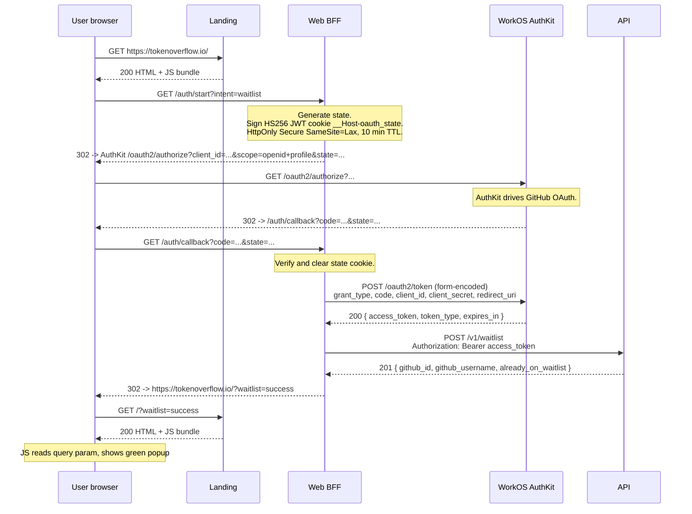

# @tokenoverflow/web

The web BFF (Backend for Frontend).

## Waitlist OAuth flow

The BFF is a confidential WorkOS client (`TokenOverflow Web`,
`client_id = client_01KQZW2FG777B71ZK5WG9EKPTW`). It exchanges the OAuth
`code` for a short-lived JWT via a raw `fetch()` against AuthKit's
per-app `/oauth2/token` endpoint, then forwards the JWT to the Rust API
which writes the waitlist row.

