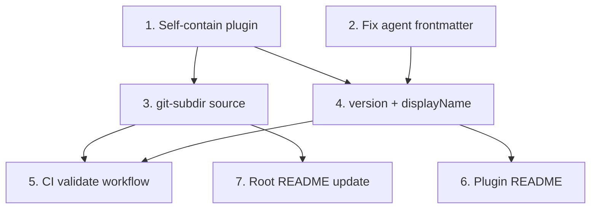

# Design: Claude Plugin Marketplace

## Context & Problem

The TokenOverflow Claude Code plugin lives at `integrations/claude/` and is
functional when loaded via `--plugin-dir` for local development. To distribute
it to end users, Claude Code requires the plugin to be referenced from a
**marketplace** catalog (`.claude-plugin/marketplace.json`) that users add
with `/plugin marketplace add` and install from with `/plugin install`.

A stub `marketplace.json` exists at the repo root but is not fit for
distribution:

1. It uses a relative-path plugin source (`./integrations/claude`). Both the
   marketplace add and the plugin install would full-clone the monorepo (Rust
   workspace, TS apps, infra, Docker assets) just to get a small plugin.
2. The plugin's `SessionStart` hook reads
   `${CLAUDE_PLUGIN_ROOT}/instructions.md`. That path resolves through a
   symlink at `integrations/claude/instructions.md` to the real file at
   `integrations/common/instructions.md` outside the plugin root. Claude
   Code only copies the plugin directory to its cache and the symlink
   target is not fetched by a sparse checkout, so the hook fails for real
   end-user installs.
3. There is no validation in CI. A malformed `marketplace.json` or `plugin.json`
   would silently break installs.
4. There is no validated install snippet in the README. End users have no
   reliable way to install the plugin today.

This design defines the marketplace layout, plugin sourcing, versioning,
validation, and release process needed to ship the plugin to real users.
References: brief at `docs/brief/2026_01_31_tokenoverflow.md`, plugin source at
`integrations/claude/`, marketplace docs at
<https://code.claude.com/docs/en/plugin-marketplaces>.

## In Scope

1. A single `marketplace.json` at the monorepo root that lists the
   `tokenoverflow` plugin with a `git-subdir` source so plugin installs
   sparse-clone only `integrations/claude/`.
2. A self-contained plugin directory at `integrations/claude/` where every
   file referenced by hooks, skills, or agents lives inside the plugin root
   (no `../common/...` references).
3. Explicit semantic versioning for the plugin (`version` in
   `plugin.json`) with a documented release workflow.
4. A pre-commit hook that runs `claude plugin validate --strict` against
   the marketplace and the plugin when `.claude-plugin/**` or
   `integrations/claude/**` changes.
5. End-user installation instructions in the root `README.md` and in
   `integrations/claude/README.md`, including the recommended `--sparse`
   flag for the marketplace add.

## Out of Scope

1. **Separate marketplace repository.** Keeping the catalog in the monorepo
   simplifies releases. We can extract later if we publish more plugins.
2. **Codex CLI / Gemini CLI integrations.** The brief lists Claude Code as the
   sole MVP target. `integrations/common/` exists today but only this one
   plugin uses it. We collapse it back into the plugin until a second
   integration appears.
3. **Pre-release / stable release channels.** Single channel is enough for
   the MVP. Channels can be added later by adding a second marketplace entry
   with a different `ref` (see docs on release channels).
4. **Auto-generated marketplace.json.** Plugin metadata is small. Hand-edited
   JSON is simpler than a build step.
5. **Private / enterprise marketplaces.** Out of MVP scope per the brief.
6. **`extraKnownMarketplaces` in `.claude/settings.json`.** That is for
   teams forcing a marketplace on contributors. End users add the marketplace
   themselves.
7. **`userConfig`-driven setup.** The plugin already uses OAuth via MCP for
   credentials; no extra user inputs are needed.
8. **Submission to `anthropics/claude-plugins-community`.** Deferred until
   after public launch when the catalog has been exercised by real users.
   Tracked as a future consideration, not part of this design.

## Terminology

- **Plugin** (`integrations/claude/`): the unit Claude Code installs. Contains
  `plugin.json`, MCP config, hooks, skills, and agents.
- **Marketplace** (`.claude-plugin/marketplace.json`): the catalog that lists
  one or more plugins and how to fetch them. Lives at the repo root.
- **Marketplace source**: how Claude Code fetches the marketplace itself
  (`owner/repo` GitHub shorthand for us).
- **Plugin source**: how Claude Code fetches an individual plugin listed in
  the marketplace (`git-subdir` for us).
- **Plugin cache**: `~/.claude/plugins/cache/<marketplace>/<plugin>/<version>/`
  where the plugin directory is copied. Files outside the plugin dir are not
  copied.
- **`${CLAUDE_PLUGIN_ROOT}`**: substitution variable Claude Code expands to
  the plugin's cache directory at runtime. Use in hooks and MCP configs.

These align with the upstream docs verbatim; no new vocabulary.

## Key Decisions

### Decision 1: Where does the catalog live, and how does it reference the plugin?

The catalog and the plugin live in the same repo today (`integrations/claude/`
inside the TokenOverflow monorepo). Two fetches happen on the user's machine:

1. **Marketplace add** clones `owner/repo` so Claude Code can read
   `.claude-plugin/marketplace.json` from it.
2. **Plugin install** fetches the plugin payload using the source declared in
   that marketplace entry.

The question is the plugin source pattern and how we minimize both fetches.

#### ✅ Option 1: Same repo, `git-subdir` source + documented `--sparse`

`.claude-plugin/marketplace.json` at the monorepo root references the plugin
via `git-subdir`:

```json
{
  "name": "tokenoverflow",
  "source": {
    "source": "git-subdir",
    "url": "https://github.com/token-overflow/tokenoverflow.git",
    "path": "integrations/claude"
  }
}
```

End users add the marketplace with `--sparse .claude-plugin` so the
marketplace add only checks out the catalog directory:

```bash
/plugin marketplace add token-overflow/tokenoverflow --sparse .claude-plugin
/plugin install tokenoverflow@tokenoverflow-marketplace
```

The plugin install itself sparse-clones only `integrations/claude/` via
`git-subdir`, regardless of how the user added the marketplace.

**Pros:**
- One repo, one PR per change. No release coordination across two repos.
- Both fetches stay small when users follow the documented command. The
  marketplace add scopes its clone to the `.claude-plugin/` tree plus the
  root-level files (`git sparse-checkout` always includes the repo root).
  The plugin install pulls only `integrations/claude/` via `git-subdir`.
- Matches the upstream production pattern used by Amplitude
  (`amplitude/mcp-marketplace.git`, path `plugins/amplitude`) and Bigdata in
  the official Anthropic catalog.
- The `${CLAUDE_PLUGIN_ROOT}` path resolution is identical to a
  relative-path install, so existing hook commands keep working.

**Cons:**
- Users who forget `--sparse` clone the whole monorepo for the marketplace
  add. Bandwidth-only cost (no behavioral impact). Documented prominently in
  the install snippet and `integrations/claude/README.md`.
- Requires the plugin to be self-contained inside `integrations/claude/` (no
  references outside the dir). We fix this anyway under Decision 3.

The upstream-blessed pattern for monorepo plugins combined with the
upstream-recommended `--sparse` flag for the marketplace add. A second repo
is not yet worth the maintenance cost.

#### ❌ Option 2: Same repo, relative path source

Keep the current `"source": "./integrations/claude"` in `marketplace.json`.

**Pros:**
- One line shorter.

**Cons:**
- Plugin install does a full clone of the monorepo per install (no
  sparse-clone path). Slows every install and every auto-update.
- Relative paths silently fail when users add the marketplace via direct URL
  to `marketplace.json` (per the docs). We lose a distribution channel.

**Rationale:** Rejected. The clone-cost on every install is unjustifiable.

#### ❌ Option 3: Separate dedicated repo

Create `token-overflow/claude-plugin` containing just the marketplace and
plugin files.

**Pros:**
- Cleanest isolation.
- Marketplace add is unconditionally fast; no `--sparse` discipline needed.

**Cons:**
- Two repos to release in lockstep. Breaking changes to the MCP server in the
  monorepo need a coordinated commit in the plugin repo to update version
  expectations.
- More setup overhead (CI, branch protection, secrets, CODEOWNERS, badges).
- We already have `git-subdir` and `--sparse` available to solve the
  clone-cost problem at zero ongoing cost.

**Rationale:** Rejected for the MVP. Reconsider if we ship a second plugin
or if the plugin's release cadence diverges sharply from the monorepo.

### Decision 2: Versioning strategy for the plugin

Claude Code resolves the plugin version from `plugin.json` first, then the
marketplace entry, then the git commit SHA. The choice controls when users
receive updates.

#### ✅ Option 1: Explicit semver in `plugin.json`, manually bumped

`plugin.json` declares `"version": "0.0.1"`. We bump it whenever we change
plugin behavior (hooks, skills, agents, MCP server URL).

**Pros:**
- Deterministic: users only see updates when we deliberately ship one.
- Aligns with the existing TokenOverflow release model (cargo crates, npm
  packages, docker images all use semver).
- Lets us write meaningful changelog entries anchored on version numbers.
- Avoids spurious "updates" on unrelated monorepo commits (Rust API code,
  Terraform, etc.).

**Cons:**
- Requires discipline: forgetting to bump means existing users do not get
  changes (Claude Code keeps the cached copy because the version string
  matches). Mitigated by code review.

Deliberate over automatic for a public plugin. We deliberately do not gate
this in CI or in the pre-commit hook: the cost of a forgotten bump is a
delayed update, not a broken install, and the audit cost of a guard is not
yet justified.

#### ❌ Option 2: Omit `version`, fall back to git SHA

Drop the `version` field entirely. Every commit on `main` is a new version.

**Pros:**
- Zero ceremony.

**Cons:**
- A Terraform-only PR or a doc-only commit still bumps the version users see,
  which churns the plugin cache on every Claude Code startup.
- No human-readable changelog anchor.
- Surprises power users who pin to `ref: v0.0.1` for stability.

**Rationale:** Rejected.

#### ❌ Option 3: Tag-driven semver via GitHub Releases

`plugin.json` carries a placeholder. A release workflow replaces it with the
git tag (e.g. `v0.0.1`) on push.

**Pros:**
- Fully automated.

**Cons:**
- Extra workflow plumbing for a small payload.
- Requires the workflow to push a commit back, which complicates branch
  protection and signed commits.
- We do not have any other crate or package using this pattern in the repo,
  so it would be a one-off.

**Rationale:** Rejected. Premature automation.

### Decision 3: Fix the cross-directory reference in `${CLAUDE_PLUGIN_ROOT}`

Today `integrations/claude/hooks/hooks.json` reads
`${CLAUDE_PLUGIN_ROOT}/instructions.md`. There is a symlink at
`integrations/claude/instructions.md` pointing to
`../common/instructions.md`. After install, only `integrations/claude/` is
sparse-checked-out and copied to the cache, so the symlink lands but its
target does not. The hook only works in local development because
`--plugin-dir ./integrations/claude` resolves `${CLAUDE_PLUGIN_ROOT}` to a
directory that happens to sit next to `common/` on disk. Verified by reading
the docs note: "plugins are copied to a cache location" and "plugins can't
reference files outside their directory using paths like `../shared-utils`".

#### ✅ Option 1: Make the plugin copy canonical

Replace the existing symlink at `integrations/claude/instructions.md` with
the real file content from `integrations/common/instructions.md`. Update
the two existing consumers in the API to read from the plugin path:

- `apps/api/src/mcp/server.rs:41`: change
  `include_str!("../../../../integrations/common/instructions.md")` to
  `include_str!("../../../../integrations/claude/instructions.md")`.
- `apps/api/Dockerfile:25` and `:46`: change
  `COPY integrations/common ./integrations/common` to
  `COPY integrations/claude/instructions.md ./integrations/claude/instructions.md`
  (or copy the whole `integrations/claude` tree).

Then delete `integrations/common/` entirely. When a second integration
arrives (Codex, Gemini, etc.) we extract shared text at that point.

**Pros:**
- Plugin becomes self-contained. No build step.
- One source of truth, no copies to keep in sync.
- Aligns with YAGNI: `integrations/common/` is speculative.
- Works identically in local dev (`--plugin-dir`) and in installed cache.

**Cons:**
- Future second integration will need to re-extract the shared text. Cost is
  low: a follow-up PR to move the file back to `common/` and add a release
  copy step (Option 2 below) when that integration is being built.
- Requires touching API code in the same PR. Low risk because the change is
  a path string and `cargo build` will fail loudly if it's wrong.

Simplest fix that respects the existing system.

#### ❌ Option 2: Release-time copy from `common/` into the plugin

Keep the file in `common/`, add a release script that copies it into the
plugin dir before commit / before publishing.

**Pros:**
- Preserves the `common/` location for future shared use.

**Cons:**
- Build steps inside a public plugin are footguns: if the copy is missed in
  one PR the plugin ships broken.
- Adds a script and a pre-commit hook (or CI gate) for a problem that does
  not exist yet.

**Rationale:** Rejected for now. Adopt only when a second integration ships.

#### ❌ Option 3: Keep the existing symlink

`integrations/claude/instructions.md` stays as a symlink to
`../common/instructions.md`.

**Pros:**
- No file move; the working copy looks the same as today.

**Cons:**
- This is the status quo bug. Git preserves the symlink itself on a sparse
  checkout (mode 120000), but the target outside the plugin path is never
  fetched. The cache ends up with a dangling symlink, the `cat` in the
  `SessionStart` hook silently produces empty output, and every real
  install ships broken instructions context.
- The docs explicitly call this out: "plugins can't reference files outside
  their directory using paths like `../shared-utils`".

**Rationale:** Rejected. Broken on real installs.

### Decision 4: How do we guard the marketplace from schema breakage?

The marketplace is the public face of the plugin. A malformed `marketplace.json`
silently breaks users on their next Claude Code startup.

#### ✅ Option 1: Pre-commit hook that runs `claude plugin validate --strict`

Add a hook to the existing `.pre-commit-config.yaml` that runs only when
`.claude-plugin/**` or `integrations/claude/**` changes. The two validator
invocations are chained inline with `&&`, matching the existing inline
pattern used by `turbo-check`, `turbo-lint`, etc.:

```yaml
- id: claude-plugin-validate
  name: Claude Plugin Validate
  entry: bash -c 'claude plugin validate . --strict && claude plugin validate ./integrations/claude --strict'
  language: system
  files: ^(\.claude-plugin/|integrations/claude/)
  pass_filenames: false
```

The `claude` CLI is already declared in `Brewfile` as
`cask "claude-code@latest"`, so no new tool install is needed.

**Pros:**
- Catches schema errors, duplicate plugin names, source path traversal,
  YAML frontmatter problems, and `hooks/hooks.json` JSON errors before the
  commit lands.
- `--strict` upgrades warnings (unrecognized fields, non-kebab-case names) to
  errors so we never ship a sloppy manifest.
- Zero CI footprint: no new GitHub Actions workflow, no runner minutes
  burned on every PR.
- Matches the project's existing convention of doing heavy lifting in
  pre-commit and keeping CI thin.

**Cons:**
- A contributor who bypasses pre-commit (`--no-verify`) can land a broken
  config. Acceptable: the project's CLAUDE.md already forbids bypassing
  hooks, and the cost of a missed validation is a broken cache on next
  startup, not silent data loss.
- The `claude` CLI must be installed locally. Already true via the
  Brewfile, so this is not new friction.

#### ❌ Option 2: GitHub Actions workflow that runs `claude plugin validate`

A new `.github/workflows/claude_plugin.yml` runs the same validator on every
PR and push to `main`.

**Pros:**
- Catches failures even when contributors bypass pre-commit.
- No local tool requirement.

**Cons:**
- Out of scope: the user explicitly opted to keep this work within
  pre-commit and not add a CI workflow.
- Adds runner minutes and another workflow to maintain.

**Rationale:** Rejected for the MVP. Pre-commit covers the same checks
without the CI overhead.

#### ❌ Option 3: Manual validation only

Document the validate command in the plugin README.

**Pros:**
- Lowest cost.

**Cons:**
- One forgotten run breaks production for every existing user when they
  next start Claude Code.

**Rationale:** Rejected.

### Decision 5: Submit to Anthropic's community marketplace?

End users discover plugins primarily through the official and community
marketplaces shipped with Claude Code. Our own marketplace requires a manual
`/plugin marketplace add` step.

#### ✅ Option 1: Defer until after public launch

Ship the standalone marketplace first. Let real users exercise the install
flow, the OAuth handshake, and the skills/hooks/MCP integration. Submit to
`anthropics/claude-plugins-community` later when the catalog is proven
stable. Tracked as a follow-up outside this design.

**Pros:**
- One less moving part for the MVP. We control the release cadence
  unconditionally.
- Avoids a public review while we may still be iterating on plugin shape.
- Standalone install still works end-to-end; the marketplace add is one
  documented command.

**Cons:**
- Every user has to know our marketplace name to add it. Acceptable for the
  initial launch when distribution is driven by our own channels (README,
  docs, social).

Defer reduces blast radius for the launch.

#### ❌ Option 2: Submit now

Submit to `anthropics/claude-plugins-community` as part of the MVP rollout
once Tasks 1-7 land.

**Pros:**
- Discoverability: appears in `/plugin` Discover for every Claude Code user.
- Free distribution channel.

**Cons:**
- Anthropic review can take a few days and locks us to a specific commit SHA
  bumped nightly. A second release cadence emerges before we are ready.
- Catalog churn during the early days reflects on the community list.

**Rationale:** Rejected for now. Revisit once the catalog has settled.

## Architecture Overview

```
End User                       Claude Code                          GitHub
   |                                |                                  |
   | /plugin marketplace add        |                                  |
   |   token-overflow/tokenoverflow |                                  |
   |   --sparse .claude-plugin      |                                  |
   |------------------------------->| sparse clone .claude-plugin/     |
   |                                |--------------------------------->|
   |                                |<--- marketplace.json -----------|
   |                                |                                  |
   | /plugin install                |                                  |
   |   tokenoverflow@               |                                  |
   |   tokenoverflow-marketplace    |                                  |
   |------------------------------->| sparse clone integrations/claude |
   |                                |  (via git-subdir)                |
   |                                |--------------------------------->|
   |                                |<--- plugin files only -----------|
   |                                |                                  |
   |                                | copy to                          |
   |                                | ~/.claude/plugins/cache/         |
   |                                |  tokenoverflow-marketplace/      |
   |                                |  tokenoverflow/0.0.1/            |
   |                                |                                  |
   | claude (start session)         |                                  |
   |------------------------------->| run SessionStart hook            |
   |                                |   cat ${CLAUDE_PLUGIN_ROOT}/     |
   |                                |       instructions.md            |
   |                                | start MCP server                 |
   |                                |   https://api.tokenoverflow.io/  |
   |                                |       mcp (OAuth)                |
   |<-- Claude has TokenOverflow ---|                                  |
   |    skills, hooks, MCP tools    |                                  |
```

Three repos do not exist here, only one: the monorepo. Two artifacts ship
from it: the marketplace catalog (at the root) and the plugin (under
`integrations/claude/`). Claude Code fetches each independently.

## Third Party Dependencies

| Capability                       | Choice                              | Alternatives considered                                                       | Why this one                                                                              |
| -------------------------------- | ----------------------------------- | ----------------------------------------------------------------------------- | ----------------------------------------------------------------------------------------- |
| Plugin distribution              | Claude Code marketplace             | Manual `--plugin-dir` instructions; bundling via npm directly                  | Native, documented, supports automatic updates and discovery via `/plugin`                |
| Plugin source fetch              | `git-subdir` source                 | Relative path; full `github` source; `npm` package                            | Sparse clone keeps installs lean for monorepo; matches official Anthropic pattern         |
| Validation                       | `claude plugin validate --strict`   | Hand-written JSON Schema checks; SchemaStore JSON Schema                       | Official validator runs the same checks as the community marketplace review pipeline      |
| CLI install in CI                | `@anthropic-ai/claude-code` via npm | Native installer download                                                     | One-liner on Ubuntu runners; works without sudo and without bootstrapping a fresh shell    |
| Plugin manifest schema           | Anthropic plugin.json + marketplace.json | Independent schema like Cursor extensions, MCP-Bundle (DXT)                | Required by the runtime. No alternative for Claude Code distribution.                     |

No new runtime dependencies. We are configuring an existing first-party
distribution channel.

## Structure

```
tokenoverflow/                        # monorepo root
├── .claude-plugin/
│   └── marketplace.json              # marketplace catalog (updated)
├── .github/
│   └── workflows/
│       └── claude_plugin.yml         # NEW: claude plugin validate --strict
├── integrations/
│   └── claude/                       # the plugin itself (self-contained)
│       ├── .claude-plugin/
│       │   └── plugin.json           # adds "version", "displayName"
│       ├── .mcp.json
│       ├── README.md                 # NEW: install + usage
│       ├── agents/
│       │   └── tokenoverflow-researcher.md  # mcpServers removed, tools whitelist extended
│       ├── hooks/
│       │   ├── hooks.json
│       │   └── pre_submit_check.sh
│       ├── instructions.md           # MOVED from integrations/common/
│       ├── skills/
│       │   ├── downvote-and-submit-answer/SKILL.md
│       │   ├── search-tokenoverflow/SKILL.md
│       │   └── submit-to-tokenoverflow/SKILL.md
│       └── tags.md
├── integrations/common/              # DELETED (only had instructions.md)
└── README.md                         # updated install instructions
```

Plugin name in `plugin.json`: `tokenoverflow` (unchanged).
Marketplace name in `marketplace.json`: `tokenoverflow-marketplace` (unchanged,
matches the README and tests).

## Specs & Standards

The design conforms to the published Claude Code plugin and marketplace
specs:

- Marketplace manifest schema:
  <https://code.claude.com/docs/en/plugin-marketplaces#marketplace-schema>.
  Required fields `name`, `owner`, `plugins`. We add optional `description`
  and `$schema`.
- Plugin manifest schema:
  <https://code.claude.com/docs/en/plugins-reference#plugin-manifest-schema>.
  We populate `name`, `displayName`, `version`, `description`, `author`,
  `homepage`, `repository`, `license`, `keywords`. We do not use
  `userConfig`, `channels`, or `dependencies` for the MVP.
- Plugin sources, `git-subdir` shape:
  <https://code.claude.com/docs/en/plugin-marketplaces#git-subdirectories>.
- Marketplace add `--sparse` flag:
  <https://code.claude.com/docs/en/plugin-marketplaces#plugin-marketplace-add>.
- Plugin caching and the `${CLAUDE_PLUGIN_ROOT}` variable:
  <https://code.claude.com/docs/en/plugins-reference#environment-variables>.
- Plugin name kebab-case warning (becomes hard error when submitted to the
  community marketplace):
  <https://code.claude.com/docs/en/plugin-marketplaces#marketplace-validation-errors>.
- Validation CLI: `claude plugin validate <path> [--strict]`,
  <https://code.claude.com/docs/en/plugin-marketplaces#validation-and-testing>.
- Naming reservation: `claude-plugins-official`, `claude-code-marketplace`,
  etc. are reserved. Our chosen `tokenoverflow-marketplace` is not reserved.

We are not introducing any new wire formats. All bytes that cross a process
boundary (between Claude Code and our marketplace, plugin, MCP server, hook
scripts) are governed by the spec links above.

## Interfaces

### Marketplace catalog (`.claude-plugin/marketplace.json`)

```jsonc
{
  "$schema": "https://json.schemastore.org/claude-code-marketplace.json",
  "name": "tokenoverflow-marketplace",
  "description": "A shared memory of verified solutions, so the next agent never has to start from scratch.",
  "owner": {
    "name": "TokenOverflow",
    "email": "info@tokenoverflow.io"
  },
  "plugins": [
    {
      "name": "tokenoverflow",
      "description": "A shared memory of verified solutions, so the next agent never has to start from scratch.",
      "source": {
        "source": "git-subdir",
        "url": "https://github.com/token-overflow/tokenoverflow.git",
        "path": "integrations/claude"
      }
    }
  ]
}
```

Notes:

- `version` lives in `plugin.json` only. Per the docs, putting it in both
  places lets `plugin.json` silently win and risks stale marketplace state.
  The current `marketplace.json` has `"version": "0.0.1"` on the plugin
  entry; Task 2 removes it.
- `description` lives at the top level, not under the legacy `metadata`
  wrapper. The schema accepts both for backward compatibility, but the
  official Anthropic catalog uses top-level; we match. Task 2 drops the
  `metadata` wrapper.
- `ref` and `sha` are omitted so the marketplace tracks `main`. End users can
  pin a tag manually by appending `@v0.0.1` when adding the marketplace.

### Plugin manifest (`integrations/claude/.claude-plugin/plugin.json`)

```jsonc
{
  "$schema": "https://json.schemastore.org/claude-code-plugin-manifest.json",
  "name": "tokenoverflow",
  "displayName": "TokenOverflow",
  "description": "A shared memory of verified solutions, so the next agent never has to start from scratch.",
  "version": "0.0.1",
  "author": {
    "name": "TokenOverflow",
    "email": "info@tokenoverflow.io"
  },
  "homepage": "https://tokenoverflow.io",
  "repository": "https://github.com/token-overflow/tokenoverflow",
  "license": "MIT",
  "keywords": [
    "knowledge-base",
    "mcp",
    "agent-memory",
    "coding-solutions"
  ]
}
```

`$schema` is a hint for editor tooling; Claude Code ignores it at load time
per the docs.

### End-user install commands

The recommended snippet for the README and the plugin's README:

```bash
# Add the marketplace catalog. Sparse-clones only .claude-plugin/.
/plugin marketplace add token-overflow/tokenoverflow --sparse .claude-plugin

# Install the plugin. Sparse-clones only integrations/claude/ via git-subdir.
/plugin install tokenoverflow@tokenoverflow-marketplace

# Complete the OAuth flow exposed by the bundled MCP server.
/mcp
```

When the plugin is later accepted into
`anthropics/claude-plugins-community` (out of scope for this design), users
who already have that catalog added will be able to skip the marketplace
add and install with `/plugin install tokenoverflow@claude-community`.

### Validation CLI (pre-commit hook)

```bash
claude plugin validate . --strict
claude plugin validate ./integrations/claude --strict
```

## Existing Code & Reuse

| Asset                                        | Status            | What changes                                                                 |
| -------------------------------------------- | ----------------- | ----------------------------------------------------------------------------- |
| `.claude-plugin/marketplace.json`            | Exists, partial   | Swap relative path for `git-subdir`. Drop the legacy `metadata` wrapper, promote `description` to the top level, add `$schema`. Remove the `version` field on the plugin entry so `plugin.json` is the single version source. |
| `integrations/claude/.claude-plugin/plugin.json` | Exists       | Add `version`, `displayName`, `$schema`.                                      |
| `integrations/claude/.mcp.json`              | Exists            | No change. OAuth flow already wired.                                          |
| `integrations/claude/hooks/hooks.json`       | Exists            | No change (path keeps pointing at `${CLAUDE_PLUGIN_ROOT}/instructions.md`).   |
| `integrations/claude/hooks/pre_submit_check.sh` | Exists         | No change.                                                                    |
| `integrations/claude/skills/*`               | Exists            | No change.                                                                    |
| `integrations/claude/agents/tokenoverflow-researcher.md` | Exists | Remove the unsupported `mcpServers:` frontmatter (rejected by `--strict`). Migrate the intended tool scoping to the existing `tools:` whitelist by appending the four MCP tools the agent body calls. |
| `integrations/common/instructions.md`        | Exists            | Move into `integrations/claude/` as a real file (replacing the existing symlink). Delete `integrations/common/`. |
| `apps/api/src/mcp/server.rs`                 | Exists            | Update `include_str!` on line 41 to point at `integrations/claude/instructions.md`. |
| `apps/api/Dockerfile`                        | Exists            | Update the two `COPY integrations/common` lines (25 and 46) to copy from `integrations/claude/`. |
| `README.md` install snippet                  | Exists            | Add `--sparse .claude-plugin` to the marketplace add command.                |
| `integrations/claude/README.md`              | Missing           | Add. Documents install, OAuth, troubleshooting, and release flow.            |
| `.pre-commit-config.yaml`                    | Exists            | Add a `claude-plugin-validate` hook under the `repo: local` block, gated on `^(\.claude-plugin/\|integrations/claude/)`. Validator chained inline with `bash -c '... && ...'`. |
| `Brewfile`                                   | Exists            | No change. `cask "claude-code@latest"` already provides the `claude` CLI.    |
| `scripts/src/claude.sh`, `scripts/src/mcp.sh` | Exist            | No change; they already use `--plugin-dir ./integrations/claude`.            |

Nothing in the design duplicates an existing capability. We are filling gaps,
not parallel-implementing.

## Logic

One piece of logic introduced by this design.

### Pre-commit validation hook

Add a `claude-plugin-validate` hook to the existing `.pre-commit-config.yaml`
under the `repo: local` block, alongside the other project-local hooks. The
two validator invocations are chained inline with `bash -c '... && ...'`,
matching the existing style used by `turbo-check` and friends:

```yaml
- id: claude-plugin-validate
  name: Claude Plugin Validate
  entry: bash -c 'claude plugin validate . --strict && claude plugin validate ./integrations/claude --strict'
  language: system
  files: ^(\.claude-plugin/|integrations/claude/)
  pass_filenames: false
```

The hook is gated on `files:` so it only runs when the marketplace or plugin
tree changes. It does not run on unrelated commits.

The hook catches schema errors in `marketplace.json` and `plugin.json`,
hook JSON, skill YAML frontmatter, source path traversals, and unsupported
agent frontmatter fields before the commit lands.

### Release flow

The canonical contributor-facing copy lives in `integrations/claude/README.md`
(Task 6). The design records the steps once here so the plan is reviewable
without opening the new README.

A release is three actions, none of which require a separate deployment:

1. **Bump the plugin version** in
   `integrations/claude/.claude-plugin/plugin.json`. Semver: patch for hook /
   skill / agent / docs fixes; minor for new skills, agents, or MCP changes;
   major for breaking changes (renames, removed skills).
2. **Merge to `main`**. Auto-update users (Anthropic-curated only by default;
   third-party marketplaces start with auto-update off) pull the new commit
   on next Claude Code startup. Manual users run `/plugin marketplace update
   tokenoverflow-marketplace`.
3. **Tag the release** with `vMAJOR.MINOR.PATCH` so users can pin via
   `/plugin marketplace add token-overflow/tokenoverflow@v0.0.1` if they want
   stability.

No artifact upload, no S3 push. The marketplace and plugin files are read
straight from GitHub by Claude Code.

## Edge Cases & Constraints

- **Marketplace add without `--sparse`.** Users who run the bare
  `/plugin marketplace add token-overflow/tokenoverflow` clone the whole
  monorepo just for `.claude-plugin/marketplace.json`. The install still
  works; it is purely a bandwidth cost on first add and on auto-update. We
  document `--sparse .claude-plugin` in the install snippet and in
  `integrations/claude/README.md` to nudge users to the lean path.
- **Reserved marketplace names.** `tokenoverflow-marketplace` is not on the
  reserved list (`claude-code-marketplace`, `claude-plugins-official`, etc.,
  per docs). Cannot impersonate official names; we do not.
- **kebab-case names.** Both `tokenoverflow` (plugin) and
  `tokenoverflow-marketplace` (catalog) are kebab-case. `--strict` validation
  enforces this.
- **`$schema` field.** Claude Code ignores it at load time per the docs. We
  add it for editor tooling only.
- **Setting `version` in both `plugin.json` and the marketplace entry.** Docs
  warn that `plugin.json` wins silently. We keep `version` in `plugin.json`
  only.
- **`integrations/common/` is referenced from the API.** Yes:
  `apps/api/src/mcp/server.rs:41` does `include_str!` of the file at
  compile time, and `apps/api/Dockerfile:25` and `:46` copy
  `integrations/common` into the image. Task 1 updates both consumers to
  point at `integrations/claude/instructions.md` before the directory is
  deleted, so `cargo build` and the docker image build both stay green.
- **Sparse clone support.** `git-subdir` requires a server-side that supports
  sparse-checkout. GitHub does. Claude Code uses its bundled git operations
  per the docs. No user-side action needed for the plugin install itself.
- **120s git timeout.** Default Claude Code git timeout is 120s. A sparse
  clone of `integrations/claude/` from a multi-hundred-MB monorepo finishes
  well under that. Documented escape hatch:
  `CLAUDE_CODE_PLUGIN_GIT_TIMEOUT_MS` env var if a user reports a timeout.
- **Auto-update.** Disabled by default for third-party marketplaces. Document
  the manual `/plugin marketplace update` flow in
  `integrations/claude/README.md`.
- **OAuth credentials.** The plugin's `.mcp.json` references a hard-coded
  `clientId` (`client_01KN3MGDJEZSGSXWH8YKKDCB2T`). README already calls this
  out under the Authentication section. No change.
- **`scripts/src/claude.sh` hard-codes an absolute path** for the
  `claudeProcessWrapper` example. This is only a dev convenience; no impact
  on the marketplace.
- **Local dev path.** `claude_plugin` and `claude_local` in
  `scripts/src/mcp.sh` load the plugin via `--plugin-dir ./integrations/claude`.
  After the `instructions.md` move they continue to work because
  `${CLAUDE_PLUGIN_ROOT}` resolves to the plugin dir (not the cache) when
  using `--plugin-dir`. `claude_local` is currently broken in the same way
  installs are: it does `cp -R "$plugin_dir"/. "$tmp_dir"`, the symlink is
  copied verbatim, and `../common/instructions.md` does not exist in the
  temp tree. After Task 1 the file is real and the copy works.
- **`displayName` requires Claude Code v2.1.143 or later.** Earlier versions
  silently drop unrecognized top-level fields, so the field degrades
  gracefully (the plugin still loads, just without a pretty name). The
  `Brewfile` installs `claude-code@latest`, which is well above the floor.

## Test Plan

### Unit tests

None. The change is configuration, not code.

### Integration tests

- **API still builds**: `cargo build -p tokenoverflow` and the API docker
  image both build after Task 1's `include_str!` and `COPY` path updates.
- **Local marketplace add**: from a fresh worktree, run
  `claude plugin marketplace add ./.claude-plugin/marketplace.json`. Verify
  the marketplace is registered and the plugin is listed in `/plugin`.
- **Local plugin install via `--plugin-dir`**: existing scripts
  `claude_plugin` and `claude_local` continue to work. Verified by running
  them and checking the `SessionStart` hook output contains the
  `instructions.md` text.
- **Researcher agent works after frontmatter change**: invoke the
  `tokenoverflow-researcher` agent in `claude_plugin` and verify it
  successfully calls `search_questions` (the existing four MCP tools are
  reachable via the new `tools:` whitelist).
- **`claude plugin validate`** against `.` and `./integrations/claude`. Must
  pass with `--strict`.
- **Pre-commit hook fires on plugin changes**: running
  `pre-commit run claude-plugin-validate --all-files` succeeds. Staging an
  unrelated file (e.g. a Rust source under `apps/`) and running
  `pre-commit run --files <that_file>` does not trigger the hook.

### E2E tests

- **Public install dry run**: from a clean machine, run
  `/plugin marketplace add token-overflow/tokenoverflow --sparse .claude-plugin`
  then `/plugin install tokenoverflow@tokenoverflow-marketplace`. Verify:
  1. The marketplace add succeeds and lists one plugin. The on-disk clone at
     `~/.claude/plugins/marketplaces/tokenoverflow-marketplace/` contains
     only `.claude-plugin/`.
  2. The install sparse-clones only `integrations/claude/` into the cache.
  3. `/mcp` triggers the OAuth flow.
  4. After login, `search_questions` succeeds against
     `https://api.tokenoverflow.io/mcp`.
  5. `SessionStart` hook output contains the contents of
     `instructions.md`.
  6. `PostToolUse` hook reminders fire after `WebSearch`.
- **Public install without `--sparse`** (regression coverage). Same flow
  without the flag. Verify install still succeeds; the only difference is a
  fuller marketplace clone.
- **Pre-commit blocks broken commits**: stage a malformed
  `marketplace.json` (e.g. trailing comma). `git commit` must fail with a
  schema error from the validate hook.

### Out-of-scope guardrails

- We deliberately do not test private/enterprise marketplaces, alternative
  plugins, or the community-marketplace submission process. Those land in
  later phases.

## Documentation Changes

1. **Root `README.md`**: update the install snippet to include
   `--sparse .claude-plugin` and add a one-line note on the lean-clone
   behavior so contributors understand why the install footprint is small.
2. **`integrations/claude/README.md`** (new): install instructions, local
   test instructions for development (`--plugin-dir` via the existing
   `claude_plugin` / `claude_local` scripts), release flow (version bump,
   merge, tag), troubleshooting (auto-update is off by default, how to
   update manually, how to report bugs). Include a "What this plugin adds"
   section listing skills, hooks, the MCP server, and the researcher agent.
3. **CLAUDE.md** (project root): no change.
4. **`docs/brief/2026_01_31_tokenoverflow.md`**: no change.
5. **`integrations/common/`**: deleted. Move `instructions.md` to the plugin.

## Development Environment Changes

- No new Brewfile entries. `cask "claude-code@latest"` is already declared.
- No new `TOKENOVERFLOW_*` environment variables.
- `scripts/src/mcp.sh` and `scripts/src/claude.sh` keep working as-is.
- One new pre-commit hook (`claude-plugin-validate`) with the validator
  chained inline via `bash -c`. No new script files.

## Tasks

Each row is a small, independently shippable PR. Tasks are vertical: a
contributor or reviewer can validate each one without depending on later
work.

| # | Task Name | Task Description | Success Criteria | Dependencies |
|---|-----------|------------------|------------------|--------------|
| 1 | Self-contain the plugin | Replace the symlink at `integrations/claude/instructions.md` with the real file content from `integrations/common/instructions.md`. Update `apps/api/src/mcp/server.rs:41` `include_str!` to read from `integrations/claude/instructions.md`. Update both `COPY integrations/common ./integrations/common` lines in `apps/api/Dockerfile` (lines 25 and 46) to copy `integrations/claude/instructions.md` instead. Delete `integrations/common/`. | `cargo build -p tokenoverflow` succeeds. The API docker image builds. `claude_plugin` / `claude_local` start sessions whose first turn includes the instructions text. No file under `integrations/` references `../common`. | None |
| 2 | Fix the researcher agent frontmatter | Remove the unsupported `mcpServers:` field from `integrations/claude/agents/tokenoverflow-researcher.md`. Extend the existing `tools:` whitelist to include the four MCP tools the agent body calls (`mcp__tokenoverflow__search_questions`, `mcp__tokenoverflow__upvote_answer`, `mcp__tokenoverflow__downvote_answer`, `mcp__tokenoverflow__submit_answer`). | `claude plugin validate ./integrations/claude --strict` passes. Invoking the agent in `claude_plugin` resolves all four MCP tool calls successfully. | None |
| 3 | Switch marketplace source to `git-subdir` | Update `.claude-plugin/marketplace.json`: replace the relative `source` with a `git-subdir` block pointing at `integrations/claude`, drop the legacy `metadata` wrapper and promote `description` to the top level, remove the plugin-entry `version` field, add `$schema`. | `claude plugin validate .` passes with `--strict`. End-to-end install from `token-overflow/tokenoverflow` sparse-clones only `integrations/claude/`. | 1 |
| 4 | Add version + display name to `plugin.json` | Set `version: "0.0.1"`, `displayName: "TokenOverflow"`, `$schema`. | `claude plugin validate ./integrations/claude --strict` passes. `/plugin` UI shows "TokenOverflow" with version `0.0.1`. | 1, 2 |
| 5 | Pre-commit validation hook | Add the `claude-plugin-validate` hook to `.pre-commit-config.yaml` under the `repo: local` block, gated on `^(\.claude-plugin/\|integrations/claude/)`. Use `entry: bash -c 'claude plugin validate . --strict && claude plugin validate ./integrations/claude --strict'`. | `pre-commit run claude-plugin-validate --all-files` passes. A staged malformed `marketplace.json` blocks `git commit` with a schema error. The hook does not run when only unrelated files are staged. | 3, 4 |
| 6 | Plugin README | Add `integrations/claude/README.md` with four sections: (a) install (the `--sparse .claude-plugin` snippet and `/mcp` OAuth), (b) local test (how to run the plugin via `--plugin-dir` for development), (c) release (bump version, merge, tag), (d) troubleshooting (auto-update is off by default, manual `/plugin marketplace update`, how to report bugs). | A new contributor can follow the README to install the plugin, run it locally for development, and ship a new version without consulting other docs. | 4 |
| 7 | Root README update | Update the install snippet to include `--sparse .claude-plugin` and add a short note on the lean-clone behavior. | Snippet runs end-to-end against a real Claude Code install. | 3 |



Tasks 1 and 2 can ship in parallel. Tasks 3, 4, 6, and 7 unlock after them.
Task 5 must wait on Tasks 3 and 4 because the validator gates depend on
their output.

Community marketplace submission (`anthropics/claude-plugins-community`) is
deferred until after public launch and is tracked outside this design.
