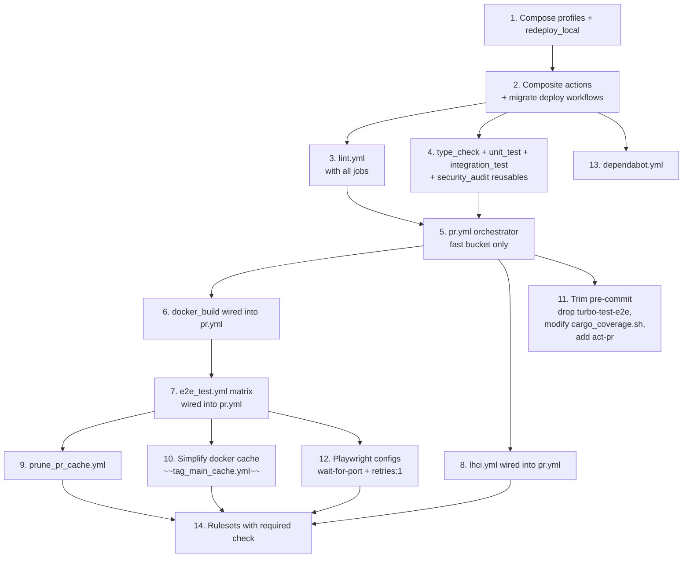

# Design: Github CI/CD Pipeline

## Context & Problem

The repository currently relies on local pre-commit for both fast developer
checks and heavyweight full-stack validation, which forces every contributor to
maintain Docker infrastructure, makes commits slow and flaky, and leaves merge
safety dependent on a hook that can be skipped. Because GitHub Actions only runs
deploy workflows on main, there is no pull-request CI status for branch
protection, so full-stack e2e and other merge-critical gates need to move into a
PR-triggered CI pipeline targeting main, while pre-commit should keep only the
fast local feedback checks.

## In Scope

- Add one `.github/workflows/pr.yml` orchestrator for PRs to `main`, using path
  filters and reusable workflows.
- Add reusable workflows for lint, type check, unit, integration, security,
  Docker build, e2e, and LHCI.
- Add `prune_pr_cache.yml` to delete PR image and cache tags from GHCR when a
  PR closes.
- Make `docker_build.yml` self-fire on `push: main` (image-affecting paths) so
  the long-lived `:buildcache` refreshes without a separate retag sidecar.
- Add composite actions for Bun install, Rust toolchain, Docker Compose startup,
  and Playwright install.
- Add one `required` aggregator job in `pr.yml` as the only branch-protection
  status check.
- Add path filters so docs-only PRs skip CI work and still pass.
- Build `api`, `embedding_service`, `landing`, and `web` images to GHCR with
  `:pr-N` tags on PR builds and `:main` on `push: main`. No SHA image tags.
- Configure BuildKit to read from `:buildcache` + `:buildcache-pr-N`, and
  write `:buildcache-pr-N` (PRs) or `:buildcache` (`push: main`) only for
  non-fork events.
- Run e2e with an `api`, `landing`, and `web` matrix pulling the `:pr-N` images
  published by `docker_build`.
- Add a reusable LHCI workflow for the landing app.
- Align Compose profiles to e2e legs and reuse the existing `redeploy_local`
  helper to boot the full stack.
- Upload Playwright reports and JUnit XML as e2e artifacts. On e2e failure,
  also dump container logs to stdout and upload them as an artifact with
  3-day retention.
- Remove the `turbo-test-e2e` pre-commit hook.
- Update pre-commit coverage so it skips the e2e binary.
- Keep all other pre-commit hooks, including unit and integration tests.
- Add an `act-pr` pre-commit hook for the lightweight local `pr.yml` path.
- Skip heavy CI steps under `act` with `if: ${{ env.ACT != 'true' }}`.
- Use GitHub Rulesets with only the `required` check enforced.
- Pin all third-party actions by full commit SHA with a version comment.

## Out of Scope

- No `pull_request_target`; use plain `pull_request`, with fork PRs skipping
  cache writes.
- No `merge_group:` trigger in v1; revisit when merge serialization matters.
- No scheduled audit cron; security audits run on every PR.
- No `e2e` label gate; e2e runs on every relevant PR by path filter.
- No Turborepo Remote Cache; v1 uses local `actions/cache` for Bun and Cargo.
- No CI auto-formatting or auto-fix commits; pre-commit owns formatting.
- No unrelated changes to `deploy_*.yml` or `terraform.yml`; only
  composite-action adoption is in scope.
- No self-hosted runners; all jobs use GitHub-hosted `ubuntu-24.04-arm`.
- No performance budgets beyond Lighthouse CI.
- No visual regression tests or snapshot infrastructure.
- No AWS/OIDC access in CI; e2e uses docker-compose-local credentials only.
- No shared Rust compilation cache; use `Swatinem/rust-cache` for Cargo target
  caching.
- No `sparse-checkout`; it is premature at this repo size.
- No 8-way Playwright sharding; suites start unsharded.

## Terminology

- **Orchestrator workflow**: `.github/workflows/pr.yml`. The only workflow
  triggered directly by `pull_request` events.
- **Reusable workflow**: a workflow file declared with `on: workflow_call:` and
  consumed by the orchestrator.
- **Composite action**: a reusable bundle of steps under
  `.github/actions/<name>/action.yml`.
- **Prepare job**: the first job in `pr.yml`. Runs a single `dorny/paths-filter`
  step and exports per-surface booleans.
- **Fast bucket**: parallel reusables that run after `prepare` and gate the
  build bucket: `lint`, `type_check`, `unit_test`, `integration_test`,
  `security_audit`, `lhci`.
- **Build bucket**: parallel group that needs the fast bucket green:
  `docker_build`.
- **Required aggregator**: the `required` job. Runs `if: always()` and is the
  single status check listed in branch protection.
- **Path filter**: a `dorny/paths-filter` step output. Outputs: `rust`, `ts`,
  `landing`, `web`, `api`, `embedding`, `docker`, `workflows`, `terraform`,
  `shell`, `markdown`, `astro`, `openapi`.

## Key Decisions

### When does the CI workflow run?

#### ✅ Option 1: pull_request to main

- Description: Single `on: pull_request: branches: [main]` trigger on the
  orchestrator.
- Pros: Standard GitHub PR gate semantics; no trust-check overhead.
- Cons: Forks cannot write to GHCR (handled by fork cascade).
- Rationale: Matches branch-protection model and the cal.com pattern.

#### ❌ Option 2: pull_request_target

- Description: Run with the base repo's permissions.
- Pros: Forks can push to GHCR.
- Cons: Trust-check job needed to gate secret exposure; footgun history.
- Rationale: Rejected; trust-check overhead not justified.

#### ❌ Option 3: push: main

- Description: Run only after merge.
- Pros: Simpler permissions.
- Cons: Cannot gate merges; PRs already need a separate check.
- Rationale: Rejected; PR-gate already runs.

#### ❌ Option 4: merge_group

- Description: Run on merge queue.
- Pros: Serializes merges.
- Cons: Not used yet; premature.
- Rationale: Out of scope for v1.

### Which runner?

#### ✅ Option 1: ubuntu-24.04-arm everywhere

- Description: All jobs on GitHub-hosted arm64 Ubuntu.
- Pros: Matches local (Apple silicon) and Lambda (arm64); free on public repos.
- Cons: Single failure mode for arm-specific bugs.
- Rationale: One cache scope; matches production target.

#### ❌ Option 2: Mix arm + ubuntu-slim

- Description: arm for builds, x86 for lint.
- Pros: Marginal speed for some legs.
- Cons: Two cache scopes; doubles cache surface.
- Rationale: Rejected for cache complexity.

#### ❌ Option 3: Larger paid runners

- Description: 16-vCPU paid runners.
- Pros: Faster builds.
- Cons: Cost; premature optimization.
- Rationale: Defer until measured.

### Workflow file organization?

#### ✅ Option 1: pr.yml orchestrator + reusables per concern

- Description: One orchestrator dispatches to reusables (lint, unit_test,
  e2e_test).
- Pros: cal.com pattern; one concern per file; reusables can be invoked
  independently.
- Cons: More files.
- Rationale: Clearest separation; matches industry pattern.

#### ❌ Option 2: Single ci.yml

- Description: One big workflow file.
- Pros: Fewer files.
- Cons: Hard to navigate; no per-concern dispatch.
- Rationale: Rejected.

#### ❌ Option 3: Per-domain top-level workflows

- Description: lint.yml, test.yml each triggered by `pull_request`
  independently.
- Pros: No orchestrator.
- Cons: Each re-runs `prepare`; harder to gate together.
- Rationale: Rejected.

#### ❌ Option 4: Pure trigger-level split

- Description: Multiple top-level workflows by trigger.
- Pros: Minimal coupling.
- Cons: No aggregator job for branch protection.
- Rationale: Rejected.

### How does prepare decide what to run?

#### ✅ Option 1: Single per-surface paths-filter step

- Description: One `dorny/paths-filter` step with the default `some` quantifier
  emits per-surface booleans (`rust`, `ts`, `markdown`, `shell`, etc.). Each
  downstream job gates on its relevant boolean. No umbrella; per-surface skips
  report `skipped`, which the aggregator treats as success.
- Pros: One step, no dead exclusion list (no truly-trivial paths exist in this
  repo), no umbrella/per-surface coordination.
- Cons: A pure `.vscode`-only PR (hypothetical, since `.vscode/` is gitignored)
  would still trigger `prepare` and the aggregator.
- Rationale: Simpler than cal.com's two-step pattern; their umbrella excludes
  paths we do not have. We rely on per-surface gates exclusively.

#### ❌ Option 2: cal.com two-step (umbrella + inclusions)

- Description: Add an umbrella step with `every` quantifier excluding trivial
  paths.
- Pros: Mirrors cal.com.
- Cons: The exclusion list would be empty (no `.vscode`, `.idea`, `.agents`,
  `.opencode` exist in this repo; all are gitignored). Dead code.
- Rationale: Rejected.

#### ❌ Option 3: Turbo `--affected` only

- Description: Skip path filters, rely on turbo.
- Pros: One source of truth.
- Cons: Launches every job; empty-affected case still costs runner minutes.
- Rationale: Rejected.

#### ❌ Option 4: Native paths: filter

- Description: Use workflow-level `paths:`.
- Pros: Built in.
- Cons: Workflow-level only; cannot drive per-job booleans.
- Rationale: Rejected.

### Job ordering?

#### ✅ Option 1: Fast bucket parallel, then docker_build, then e2e_test

- Description: Fast bucket gates the build bucket; build gates e2e.
- Pros: Fail fast on cheap checks; avoids wasted minutes when lint is red.
- Cons: Serial stages add latency to the green path.
- Rationale: Standard monorepo ladder.

#### ❌ Option 2: Fully parallel

- Description: Dispatch everything from `prepare`.
- Pros: Lowest wall time for green PRs.
- Cons: Wastes minutes when a fast check fails.
- Rationale: Rejected.

#### ❌ Option 3: Fully sequential

- Description: One job at a time.
- Pros: Simple.
- Cons: No monorepo does this; latency unacceptable.
- Rationale: Rejected.

### How does e2e get Docker images?

#### ✅ Option 1: GHCR :pr-N + compose pull

- Description: docker_build pushes `:pr-N`; e2e runs `docker compose pull` +
  `up -d --no-build --wait` against the same tag.
- Pros: Plain Compose semantics; no artifact-size limits; tag is stable within
  a workflow run (orchestrator-level `cancel-in-progress` removes the stale-tag
  race).
- Cons: One extra registry round trip per leg.
- Rationale: Native and simple.

#### ❌ Option 2: actions/cache for image layers

- Description: Cache layers in GHA cache.
- Pros: No registry traffic.
- Cons: cal.com's Node-only pattern; does not fit Rust binaries in containers;
  10 GB cap.
- Rationale: Rejected.

#### ❌ Option 3: actions/upload-artifact

- Description: Upload image tarballs.
- Pros: In-workflow.
- Cons: Size limits; slow.
- Rationale: Rejected.

### BuildKit cache layout?

#### ✅ Option 1: Hybrid `:buildcache` + `:buildcache-pr-N`

- Description: Cache tags live alongside image tags but never overlap.
  `cache-from = :buildcache + :buildcache-pr-N`. PR runs write
  `cache-to = :buildcache-pr-N,mode=max`; `push: main` runs write
  `cache-to = :buildcache,mode=max`. No separate retag workflow.
- Pros: Warm baseline plus PR-local writes; one workflow owns both paths.
- Cons: PR cache is per-PR (a brand-new branch starts from `:buildcache` only).
- Rationale: Best cache hit rate without baseline pollution; survives multiple
  pushes on the same PR (which cargo-chef + Rust monorepos benefit from most).

#### ❌ Option 2: type=gha

- Description: GHA cache backend.
- Pros: Native.
- Cons: 10 GB cap; 1 GB single-entry limit; cargo-chef deps exceed this.
- Rationale: Rejected.

#### ❌ Option 3: :main-only

- Description: All PRs write to `:main`.
- Pros: One tag.
- Cons: PRs pollute baseline.
- Rationale: Rejected.

#### ❌ Option 4: Per-PR-only

- Description: No shared baseline.
- Pros: Isolated.
- Cons: Cold cache on every new PR.
- Rationale: Rejected.

### Cache lifecycle: separate image vs cache tags?

#### ✅ Option 1: Dedicated cache tags (`:buildcache`, `:buildcache-pr-N`)

- Description: Image tags (`:pr-N`, `:main`) carry the deployable manifest;
  cache tags (`:buildcache`, `:buildcache-pr-N`) carry the intermediate
  BuildKit layers. The PR-local cache tag survives multiple pushes on the
  same PR; the main cache tag is overwritten by every `push: main` build.
  `prune_pr_cache.yml` drops both `:pr-N` and `:buildcache-pr-N` on PR close,
  and sweeps untagged digests left behind by overwrites.
- Pros: cargo-chef + Rust monorepo benefits from a writable PR-local cache
  across follow-up commits; `e2e_test.yml` pulls the stable `:pr-N` tag.
- Cons: Two tag families per image instead of one.
- Rationale: The mainstream "PR reads from main only" pattern wastes the
  warm dep-graph state that the second push to the same PR would otherwise
  hit.

#### ❌ Option 2: PR reads from `:main` only

- Description: No per-PR cache; PRs read `:main` and re-export nothing.
- Pros: One cache tag per image.
- Cons: Follow-up pushes on the same PR get no cache improvement; dep-changing
  PRs pay the cargo-chef rebuild cost on every push.
- Rationale: Rejected; the per-PR cache is the whole reason we accepted two
  tag families.

#### ❌ Option 3: Reuse image tags as cache tags

- Description: `cache-to: type=registry,ref=:pr-N` (cache and image share a
  tag).
- Pros: One tag per use case.
- Cons: Cache mode `max` writes intermediate layers under the same name as
  the deployable image; e2e cannot pull a clean artifact.
- Rationale: Rejected.

### Bun cache?

#### ✅ Option 1: `~/.bun/install/cache` keyed on bun.lock

- Description: Cache only the Bun store directory.
- Pros: Stable cache contract.
- Cons: First install still runs `bun install`.
- Rationale: Matches `oven-sh/setup-bun` guidance.

#### ❌ Option 2: node_modules

- Description: Cache the workspace `node_modules`.
- Pros: Skips `bun install` entirely.
- Cons: Brittle to platform / arch shifts.
- Rationale: Rejected.

#### ❌ Option 3: Both

- Description: Cache store + node_modules.
- Pros: Max speed.
- Cons: Marginal benefit; double cache size.
- Rationale: Rejected.

### Rust cache?

#### ✅ Option 1: Swatinem/rust-cache@v2 only

- Description: `shared-key: arm64-<toolchain>`; nothing else.
- Pros: One cache, well-maintained; plays nicely with `CARGO_INCREMENTAL`.
- Cons: No cross-job dep sharing inside Docker builds (cargo-chef covers it).
- Rationale: cargo-chef handles dep-only rebuilds inside the Dockerfile.

#### ❌ Option 2: sccache

- Description: Shared compiler cache.
- Pros: Cross-job hits.
- Cons: Disables `CARGO_INCREMENTAL`, slowing local `cargo test`.
- Rationale: Rejected.

#### ❌ Option 3: Layered cache

- Description: Multiple caches stitched together.
- Pros: Granular.
- Cons: Operational complexity.
- Rationale: Rejected.

#### ❌ Option 4: actions/cache hand-rolled

- Description: Cache `~/.cargo` and `target/` manually.
- Pros: Full control.
- Cons: Reinvents Swatinem.
- Rationale: Rejected.

### Pre-commit hooks to remove?

#### ✅ Option 1: Drop only `turbo-test-e2e`; modify cargo_coverage.sh; add act-pr

- Description: Remove the heavy e2e hook; coverage script skips the e2e binary
  locally; new hook validates the orchestrator via `act`.
- Pros: Keeps fast local checks intact; CI catches e2e regressions.
- Cons: Need CI to run e2e for every relevant PR.
- Rationale: Local feedback stays fast; merge safety moves to CI.

#### ❌ Option 2: Move all tests to CI

- Description: Strip pre-commit of all test hooks.
- Pros: Minimal local cost.
- Cons: User wants fast local feedback for unit + integration.
- Rationale: Rejected.

#### ❌ Option 3: Status quo

- Description: Keep `turbo-test-e2e`.
- Pros: No change.
- Cons: Slow and flaky locally.
- Rationale: Rejected.

### Where does security audit live?

#### ✅ Option 1: security_audit.yml reusable, three parallel jobs

- Description: `cargo audit`, `bun audit`, `trivy fs` in parallel inside one
  reusable. Two-pass per cal.com.
- Pros: PR-only; matches lint cadence; different failure semantics from lint.
- Cons: One more reusable file.
- Rationale: Mirrors cal.com.

#### ❌ Option 2: Daily cron + lockfile push

- Description: Scheduled audit.
- Pros: Detects newly published CVEs.
- Cons: cal.com is PR-only; we follow.
- Rationale: Rejected.

#### ❌ Option 3: Fold into lint.yml

- Description: Audit as a lint job.
- Pros: Fewer files.
- Cons: Different failure model; harder to reason about.
- Rationale: Rejected.

### E2E matrix shape?

#### ✅ Option 1: Matrix per app `[api, landing, web]`, compose profile per leg

- Description: Three parallel matrix legs, one Compose profile each.
- Pros: Failures isolated per app.
- Cons: Triple compose boot cost (mitigated by warm cache).
- Rationale: Cleanest parallelism for v1.

#### ❌ Option 2: One job series

- Description: All three apps in one job.
- Pros: One boot.
- Cons: Slowest; failure attribution mixed.
- Rationale: Rejected.

#### ❌ Option 3: Per-app x per-browser

- Description: Fanout over browsers too.
- Pros: Granular.
- Cons: Cost ramp; not needed v1.
- Rationale: Rejected.

### Compose profile layout?

#### ✅ Option 1: api / landing / web

- Description: `api` = postgres + migrations + pgbouncer + embedding + api.
  `landing` = landing only. `web` = full stack.
- Pros: One profile per e2e leg.
- Cons: Profiles overlap across services.
- Rationale: Maps 1:1 to e2e legs.

#### ❌ Option 2: Single profile boots everything

- Description: One profile.
- Pros: Simple.
- Cons: Every leg pays full boot cost.
- Rationale: Rejected.

#### ❌ Option 3: Per-service profiles

- Description: One profile per service.
- Pros: Maximum granularity.
- Cons: Too many; orchestration noise.
- Rationale: Rejected.

### Playwright on ubuntu-24.04-arm?

#### ✅ Option 1: All e2e legs on arm; retries: CI ? 1 : 0

- Description: Same runner family everywhere. Documented x86 fallback for
  landing if WebKit flakes.
- Pros: One cache scope; matches local dev.
- Cons: WebKit on arm64 is younger than x86 builds.
- Rationale: Single cache; fallback documented.

#### ❌ Option 2: Landing on x86 v1

- Description: Move landing leg to ubuntu-24.04.
- Pros: Mature WebKit build.
- Cons: Cache split.
- Rationale: Rejected; ship arm and fall back only if flake materializes.

#### ❌ Option 3: MS playwright container

- Description: Run Playwright inside the official image.
- Pros: Pre-installed browsers.
- Cons: Extra container layer.
- Rationale: Rejected.

### Concurrency?

#### ✅ Option 1: Workflow-level on pr.yml

- Description: Group on
  `${{ github.workflow }}-${{ github.event.pull_request.number || github.ref }}`,
  `cancel-in-progress: true`. Sidecars use `cancel-in-progress: false`.
- Pros: Cancels superseded PR runs; sidecars never cancel mid-flight.
- Cons: One scope per workflow.
- Rationale: Standard.

#### ❌ Option 2: Per-job concurrency

- Description: Concurrency on each job.
- Pros: Granular.
- Cons: YAML noise.
- Rationale: Rejected.

#### ❌ Option 3: Branch-ref-only

- Description: Group on ref only.
- Pros: Simple.
- Cons: Fork PR collisions.
- Rationale: Rejected.

### Required aggregator: contains() or per-surface gated-OR?

#### ✅ Option 1: Per-surface gated-OR

- Description: For each job, the aggregator fails only if the job's per-surface
  gate was `true` AND the job's `result != 'success'`. Skipped jobs (gate was
  `false`) report `skipped` and do not fail the aggregator.
- Pros: A docs-only PR runs only `markdown_lint` and `lychee`; if both pass,
  aggregator green. No outer umbrella guard needed.
- Cons: Expression repeats the per-surface gates from the dispatch section.
- Rationale: Skipped-as-pass is the natural behavior we want; per-surface gates
  already encode "did this job need to run."

#### ❌ Option 2: `contains(needs.*.result, 'skipped')`

- Description: Fail if any needed job is skipped or failed.
- Pros: Short.
- Cons: Fails every PR that didn't touch every surface (the common case).
- Rationale: Rejected.

#### ❌ Option 3: List every job in branch protection

- Description: Multiple required checks.
- Pros: Granular.
- Cons: cal.com moved away from this; brittle to job renames.
- Rationale: Rejected.

### Fork PR handling?

#### ✅ Option 1: Plain pull_request

- Description: Conditional `cache-to` skip on forks. Required aggregator exempts
  `docker_build` + `e2e` for fork PRs.
- Pros: No secret leak risk.
- Cons: Fork PRs lose e2e coverage.
- Rationale: Cache write isolation; documented trade-off.

#### ❌ Option 2: pull_request_target + trust-check

- Description: Trust-check job gates secret exposure.
- Pros: Forks get e2e.
- Cons: Footgun history.
- Rationale: Rejected.

#### ❌ Option 3: Reject forks

- Description: Block fork PRs.
- Pros: Simplest.
- Cons: Public repo.
- Rationale: Rejected.

### Cache prune lifecycle?

#### ✅ Option 1: One sidecar + self-firing main build

- Description: `prune_pr_cache.yml` on PR close deletes both `:pr-N` and
  `:buildcache-pr-N` and sweeps untagged digests across all five packages.
  `:buildcache` is refreshed by `docker_build.yml`'s own `push: main`
  trigger (no separate retag workflow).
- Pros: One concern per file; untagged sweep keeps GHCR bounded as `:main`
  and `:pr-N` get overwritten.
- Cons: A push that misses the docker path filter leaves `:buildcache`
  stale, but only the next dep-changing PR pays for it. Untagged cleanup
  is bounded by PR-close cadence.
- Rationale: Removing the retag sidecar simplified the lifecycle without
  losing cache freshness.

#### ❌ Option 2: Keep all PR tags

- Description: Never delete.
- Pros: Simple.
- Cons: GHCR bloat.
- Rationale: Rejected.

#### ❌ Option 3: Time-based cleanup

- Description: Cron-based deletion.
- Pros: No PR-event coupling.
- Cons: Lags PR close.
- Rationale: Rejected.

#### ❌ Option 4: Separate retag sidecar (`tag_main_cache.yml`)

- Description: Original v0 plan. A second workflow on `push: main` retagged
  the merge-commit `:sha` image as `:main`.
- Pros: Cheap (manifest copy only).
- Cons: SHA-mismatch risk: the retag workflow uses `github.sha` (merge
  commit) while PR runs publish under the PR `head.sha`; if a non-image
  push slips in between, the retag has no fresh `:sha` to copy.
- Rationale: Rejected; replaced by `docker_build.yml`'s own `push: main`
  trigger which always rebuilds from source.

### Build all 5 images or matrix-conditional?

#### ✅ Option 1: Always build all 5

- Description: Unconditional matrix `[api, embedding_service, landing, web, migrations]`.
- Pros: Stable `:pr-N` set for e2e profiles; cargo-chef + BuildKit make unchanged
  rebuilds ~30s.
- Cons: Slightly more runner time on TS-only PRs.
- Rationale: YAML complexity for marginal savings is not worth it.

#### ❌ Option 2: Matrix-conditional

- Description: Build only changed surfaces.
- Pros: Less compute.
- Cons: E2E pull contract breaks when a needed `:pr-N` does not exist.
- Rationale: Rejected.

### How are e2e Docker logs captured?

#### ✅ Option 1: step-security/gh-docker-logs on failure, stdout + 3-day artifact

- Description: `e2e_test.yml` calls
  `step-security/gh-docker-logs` with `if: failure()`. The action dumps every
  container's logs to stdout (visible inline in the failed job UI) and to a
  per-leg `docker-logs-<app>` artifact uploaded with `retention-days: 3`.
- Pros: Off-the-shelf, security-hardened fork of `jwalton/gh-docker-logs`;
  no log noise or artifact bloat on green runs; stdout gives instant
  in-browser visibility; 3-day retention keeps artifact storage bounded
  while leaving enough time to triage a failed PR.
- Cons: Flaky tests that pass on retry leave no captured logs.
- Rationale: Matches the dominant monorepo CI pattern (caller-side capture
  via well-known action) and aligns with the project's existing reliance on
  pinned third-party actions.

#### ❌ Option 2: Custom `docker_logs` composite uploaded `if: always()`

- Description: Hand-roll a sibling composite mirroring gh-docker-logs and
  upload on every run.
- Pros: One less third-party dependency.
- Cons: Reinvents an existing maintained action; artifact bloat on green
  runs (90-day default retention multiplied by every PR).
- Rationale: Rejected.

#### ❌ Option 3: `docker_compose_up` post-step uploads `compose.log` always

- Description: Original v0 intent (and the wording on the `docker_compose_up`
  interface bullet, since corrected).
- Pros: Single touchpoint.
- Cons: Composite actions cannot register true post-steps. An inline capture
  inside the composite would run before the caller's tests, missing every
  log line that matters for e2e debugging.
- Rationale: Rejected (technically infeasible).

## Architecture Overview

```
                pull_request (base: main)
                            |
                            v
              +-----------------------------+
              |          pr.yml             |
              |  (orchestrator)             |
              |                             |
              |  +---------+                |
              |  | prepare | paths-filter   |
              |  +----+----+ + flags        |
              |       |                     |
              |       v                     |
              |  +----+-------------------+ |
              |  |  fast bucket (parallel)| |
              |  |  lint, type_check,     | |
              |  |  unit_test, int_test,  | |
              |  |  security_audit, lhci  | |
              |  +----+-------------------+ |
              |       |                     |
              |       v                     |
              |  +----+-------------------+ |
              |  |  docker_build          | |
              |  |  (matrix: 4 images)    | |
              |  +----+-------------------+ |
              |       |                     |
              |       v                     |
              |  +----+-------------------+ |
              |  |  e2e_test              | |
              |  |  (matrix: 3 apps)      | |
              |  +----+-------------------+ |
              |       |                     |
              |       v                     |
              |  +----+----+                |
              |  | required| gated-OR       |
              |  +---------+                |
              +-----------------------------+

              pull_request: closed              push: main (image paths)
                            |                          |
                            v                          v
                +---------------------+    +-----------------------+
                | prune_pr_cache.yml  |    |   docker_build.yml    |
                |  delete :pr-N and   |    |  rebuild + push :main |
                |  :buildcache-pr-N   |    |  + refresh :buildcache|
                +---------------------+    +-----------------------+

   Every reusable workflow consumes composite actions under .github/actions/.
   Every job runs on ubuntu-24.04-arm.
```

## Third Party Dependencies

All third-party actions are pinned by full commit SHA with a `# vX.Y.Z` trailing
comment, matching the convention used in existing workflows. Dependabot bumps
SHA and comment in lockstep.

| Capability                   | Action                        | Notes                                                     |
| ---------------------------- | ----------------------------- | --------------------------------------------------------- |
| Repo checkout                | `actions/checkout`            | Re-use SHA (`v6.0.2`). `fetch-depth: 2` for `--affected`. |
| GHA cache                    | `actions/cache`               | Re-use SHA (`v4.3.0`). Bun store cache.                   |
| Bun install                  | `oven-sh/setup-bun`           | Re-use SHA (`v2.2.0`).                                    |
| Rust toolchain               | `dtolnay/rust-toolchain`      | Re-use SHA from `deploy_api.yml`. Stable + nightly.       |
| Rust cache                   | `Swatinem/rust-cache`         | Latest `v2` SHA. v2.9.1 (March 2026).                     |
| BuildKit setup               | `docker/setup-buildx-action`  | Latest `v3` SHA.                                          |
| Container registry login     | `docker/login-action`         | Latest `v3` SHA.                                          |
| Container image metadata     | `docker/metadata-action`      | Latest `v6` SHA. Emits tags + labels for build-push.      |
| Container image build + push | `docker/build-push-action`    | Latest `v6` SHA.                                          |
| Path-filter change detection | `dorny/paths-filter`          | Re-use SHA (`v3.0.2`).                                    |
| Playwright browsers install  | `bunx playwright install`     | Playwright's own CLI. No marketplace action.              |
| Artifact upload              | `actions/upload-artifact`     | Latest `v4` SHA.                                          |
| Docker log capture           | `step-security/gh-docker-logs` | Latest `v2` SHA. Failure-only, stdout + artifact.        |
| Trivy filesystem scan        | `aquasecurity/trivy-action`   | Latest `v0` SHA.                                          |
| Lighthouse CI                | `bun run test:lhci`           | Uses `@lhci/cli` (devDependency).                         |
| Markdown lint                | `bunx markdownlint-cli`       | Same binary as the pre-commit hook.                       |
| Shell lint                   | `shellcheck`                  | Pre-installed on `ubuntu-24.04-arm`.                      |
| Link check                   | `lychee`                      | `cargo install lychee` inside the lint job.               |
| Cargo machete                | `cargo install cargo-machete` | Cached via Swatinem.                                      |

## Structure

```
.github/
├── actions/
│   ├── bun_install/action.yml
│   ├── rust_toolchain/action.yml
│   ├── docker_compose_up/action.yml
│   └── playwright_install/action.yml
├── workflows/
│   ├── pr.yml                       # orchestrator
│   ├── lint.yml                     # reusable (multi-job)
│   ├── type_check.yml               # reusable
│   ├── unit_test.yml                # reusable (multi-job)
│   ├── integration_test.yml         # reusable
│   ├── security_audit.yml           # reusable
│   ├── docker_build.yml             # reusable + on: push: main
│   ├── e2e_test.yml                 # reusable
│   ├── lhci.yml                     # reusable
│   ├── prune_pr_cache.yml           # on: pull_request: closed
│   ├── deploy_*.yml                 # modified (consume new composite actions)
│   ├── terraform.yml                # unchanged
│   └── CLAUDE.md                    # unchanged
├── act/event_pr.json                # new (used by act-pr hook)
└── dependabot.yml                   # new
docker-compose.yml                   # modified: add profiles + image-tag/repo substitution
.pre-commit-config.yaml              # modified: drop turbo-test-e2e, add act-pr
scripts/src/docker.sh                # modified: redeploy_local boots full stack via profiles
scripts/src/git_hooks/cargo_coverage.sh  # modified: skip --test e2e
apps/web/playwright.config.ts        # modified: wait-for-port preflight, retries: 1
apps/landing/playwright.config.ts    # modified: retries: 1
```

## Specs & Standards

- **GitHub Actions workflow schema**: pre-commit `check-yaml` enforces
  parse-ability.
- **Reusable workflows**: `on: workflow_call:` with explicit `inputs:` and
  `secrets: inherit`.
- **OCI Image Format**: every image follows the OCI image spec via BuildKit.
- **Docker Compose Specification**: `profiles:` on each service;
  `${VAR:-default}` interpolation for image references.
- **Playwright reporters**: `[list, html, junit]`.
- **Lighthouse CI**: `.lighthouserc.json` at repo root.
- **Env-var naming**: every new env var is prefixed `TOKENOVERFLOW_`. New:
  `TOKENOVERFLOW_IMAGE_TAG`, `TOKENOVERFLOW_IMAGE_REPO`.
- **SHA pinning**: `uses: org/action@<40-char-sha> # vX.Y.Z`.
- **GitHub Rulesets**: required status checks via Settings > Rules > Rulesets.

## Interfaces

### Composite actions

- **`bun_install`** (no inputs): pins Bun `1.3.13`, caches
  `~/.bun/install/cache` keyed on `bun.lock`, runs
  `bun install --frozen-lockfile`.
- **`rust_toolchain`** (inputs: `toolchain` = `stable` | `nightly`): installs
  the toolchain, then `Swatinem/rust-cache@v2` with
  `shared-key: arm64-<toolchain>`.
- **`docker_compose_up`** (inputs: `profile`, `tag`): logs in to GHCR, exports
  `TOKENOVERFLOW_IMAGE_TAG`/`TOKENOVERFLOW_IMAGE_REPO`, runs
  `docker compose --profile <profile> pull --policy always` then
  `up -d --no-build --wait --wait-timeout 600`. Logs are captured by the
  caller via `step-security/gh-docker-logs` on failure (composite actions
  cannot register true post-steps; see Key Decision "How are e2e Docker
  logs captured?").
- **`playwright_install`** (inputs: `app` = `landing` | `web`): restores
  Playwright browser cache keyed on `bun.lock`, runs
  `bunx --filter=@tokenoverflow/<app> playwright install --with-deps` on miss.

### Reusable workflow: `lint.yml`

Inputs: `rust`, `ts`, `shell`, `markdown`, `terraform`, `landing`, `api`,
`astro`, `openapi`, `workflows` (all booleans).

Jobs (each gated by one input, parallel):

- `rust_lint` (rust): `cargo +nightly fmt --all -- --check`,
  `cargo clippy --workspace --tests -- -D warnings`, `cargo machete`.
- `ts_lint` (ts): `bun run turbo run lint --affected`,
  `format:check --affected`, `lint:css --affected`.
- `shell_lint` (shell): `shellcheck scripts/**/*.sh`.
- `markdown_lint` (markdown): `bunx markdownlint-cli **/*.md`.
- `lychee` (markdown || landing): `lychee --config .lychee.toml`.
- `astro_guards` (astro): `forbid_is_inline.sh`, `forbid_raw_raster_img.sh`.
- `openapi_drift` (openapi || rust): `check_openapi_spec_drift.sh`.
- `tflint` (terraform): `scripts/src/git_hooks/tflint.sh`.

### Reusable workflow: `type_check.yml`

Input: `ts`. Runs `bun run turbo run check --affected`.

### Reusable workflow: `unit_test.yml`

Inputs: `rust`, `ts`, `shell`. Three parallel jobs:

- `vitest_unit` (ts): `bun run turbo run test:coverage --affected`.
- `cargo_test_unit` (rust): `cargo test --workspace` (excludes the e2e binary).
- `bashunit` (shell):
  `find scripts/tests -type f -name 'test_*.sh' -exec bashunit {} +`.

### Reusable workflow: `integration_test.yml`

Inputs: `rust`, `ts`. Rust: `cargo test --test integration` (uses
testcontainers). TS: `bun run turbo run test:integration --affected`.

### Reusable workflow: `security_audit.yml`

Inputs: `rust`, `ts`, `docker`. Three parallel jobs: `trivy` (always;
`trivy fs --severity HIGH,CRITICAL .`); `cargo_audit` (rust, two-pass);
`bun_audit` (ts, two-pass).

### Reusable workflow: `docker_build.yml`

Permissions: `contents: read`, `packages: write`. Triggers: `workflow_call`
(from `pr.yml`), `workflow_dispatch`, and `push: main` on the image-affecting
path filter. Matrix over `[api, embedding_service, landing, web, migrations]`.
Tags come from `docker/metadata-action`: `type=ref,event=pr` writes `:pr-N`
on PR builds; `type=ref,event=branch` writes `:main` on `push: main`. No SHA
image tags.

Cache layout:

- `cache-from`: `:buildcache` (always) plus `:buildcache-pr-N` on PR events
  only, via an expression ternary. `push: main` and `workflow_dispatch` emit
  no second ref, so `docker/build-push-action` only imports `:buildcache`.
- `cache-to`: PR runs write `:buildcache-pr-N,mode=max`; `push: main` and
  `workflow_dispatch` runs write `:buildcache,mode=max`.

Push gate: `push: main`, `workflow_dispatch`, and same-repo PRs push to GHCR;
fork PRs build but cannot push. Per-image concurrency group prevents two
concurrent `push: main` builds from racing for the same `:buildcache` slot.
Dockerfiles use cargo-chef; no host-built binary is fed in.

### Reusable workflow: `e2e_test.yml`

Permissions: `contents: read`, `packages: read`. Matrix over
`[api, landing, web]`. Each leg uses `docker_compose_up` with
`tag: pr-${{ github.event.pull_request.number || 'main' }}` to pull the image
published by `docker_build`, then runs:

- `api`: `cargo test --test e2e -- --test-threads=1`.
- `landing`: `bun run --filter=@tokenoverflow/landing test:e2e`.
- `web`: `bun run --filter=@tokenoverflow/web test:e2e`.

Artifacts (always): `apps/<app>/playwright-report/**`,
`apps/<app>/test-results/**`. On failure only, an additional
`docker-logs-<app>` artifact is uploaded with `retention-days: 3`, and the
same logs are dumped to stdout for in-UI debugging.

### Reusable workflow: `lhci.yml`

Single job: `actions/checkout`, `bun_install`,
`bun run --filter=@tokenoverflow/landing build`,
`bun run --filter=@tokenoverflow/landing test:lhci`. Reads `.lighthouserc.json`
at repo root.

### Sidecar workflows

- **`prune_pr_cache.yml`**: `on: pull_request: types: [closed]`. Deletes both
  `:pr-N` and `:buildcache-pr-N` tags from GHCR for every image and sweeps
  untagged digests (`delete-untagged: true`) so overwritten `:main` and
  `:pr-N` versions do not accumulate.

`docker_build.yml` doubles as the `:buildcache` refresh path via its own
`push: main` trigger; no separate retag sidecar exists.

### Path-filter outputs (emitted by `prepare`)

| Output      | Source paths                                                                                                      |
| ----------- | ----------------------------------------------------------------------------------------------------------------- |
| `rust`      | `apps/api/**`, `apps/embedding_service/**`, `apps/so_tag_sync/**`, `Cargo.toml`, `Cargo.lock`                     |
| `ts`        | `apps/web/**`, `apps/landing/**`, `packages/**`, `apps/api/openapi.json`, `bun.lock`, `bunfig.toml`, `turbo.json` |
| `landing`   | `apps/landing/**`                                                                                                 |
| `web`       | `apps/web/**`                                                                                                     |
| `api`       | `apps/api/**`                                                                                                     |
| `embedding` | `apps/embedding_service/**`                                                                                       |
| `docker`    | `apps/*/Dockerfile`, `infra/docker/**`                                                                            |
| `workflows` | `.github/workflows/**`, `.github/actions/**`                                                                      |
| `terraform` | `terraform/**`, `**/*.tf`, `**/*.tftpl`                                                                           |
| `shell`     | `**/*.sh`, `scripts/**`                                                                                           |
| `markdown`  | `**/*.md`, `**/*.mdx`                                                                                             |
| `openapi`   | `apps/api/openapi.json`                                                                                           |
| `astro`     | `apps/landing/**/*.astro`                                                                                         |

## Existing Code & Reuse

- **cal.com's `pr.yml`** inspires the orchestrator and the gated-OR aggregator.
  We diverge by dropping the umbrella (no truly-trivial paths in this repo) and
  by skipping the trust-check job and the `sparse-checkout` optimization.
- SHA pins for `actions/checkout`, `actions/cache`, `oven-sh/setup-bun`,
  `dtolnay/rust-toolchain`, `dorny/paths-filter`,
  `aws-actions/configure-aws-credentials` are reused from existing workflows.
- `ubuntu-24.04-arm` is already used in `deploy_api.yml`.
- `docker-compose.yml` healthchecks already exist on every service;
  `up -d --wait` works against them.
- `pgvector/pgvector:0.8.2-pg18` is preserved.
- `TOKENOVERFLOW_*` env-var convention is enforced repo-wide.
- Existing deploy workflows consume the new `bun_install` and `rust_toolchain`
  composite actions; their triggers are untouched.
- api e2e tests exist at `apps/api/tests/e2e/**`; the entry is registered in
  `apps/api/Cargo.toml` as `[[test]] name = "e2e"`.
- `apps/api/Dockerfile` already uses cargo-chef.
- Pre-commit `trivy`, `markdownlint`, `shellcheck`, `lychee`, `tflint`,
  `bashunit`, `cargo-machete`, `check-openapi-spec-drift`, `forbid-is-inline`,
  `forbid-raw-raster-img` hooks all map to new reusable jobs.
- `.lighthouserc.json` at the repo root is reused by both pre-commit and the new
  `lhci.yml`.

## apps/api e2e infrastructure audit

- API e2e tests do not use testcontainers; they require an external Postgres
  stack via `pgbouncer` -> `postgres`.
- API e2e tests call the API over real HTTP through `TestClient`; the API must
  run as a separate container.
- API e2e tests exercise the real embedding service; the `embedding_service`
  container must be running.
- MCP e2e tests call the API-hosted MCP server over HTTP; no extra MCP service
  is needed beyond the `api` profile.
- The API e2e leg requires the full compose `api` profile.
- API integration tests do use testcontainers; `ubuntu-24.04-arm` provides
  Docker by default.
- The API e2e command is `cargo test --test e2e -- --test-threads=1`.
  `--test-threads=1` is required because the e2e tier shares one live Postgres
  database.

## Logic

### `prepare` job (in `pr.yml`)

Runs a single `dorny/paths-filter` step. `timeout-minutes: 5`. Outputs the
booleans listed under Path-filter outputs.

```yaml
- name: Per-surface inclusions
  id: filter
  uses: dorny/paths-filter@<sha>
  with:
      filters: |
          rust: ['apps/api/**', 'apps/embedding_service/**', 'apps/so_tag_sync/**', 'integrations/**', 'Cargo.toml', 'Cargo.lock']
          ts: ['apps/web/**', 'apps/landing/**', 'packages/**', 'apps/api/openapi.json', 'package.json', 'bun.lock', 'bunfig.toml', 'turbo.json']
          landing: ['apps/landing/**']
          web: ['apps/web/**']
          api: ['apps/api/**']
          embedding: ['apps/embedding_service/**']
          docker: ['docker-compose.yml', 'apps/*/Dockerfile', 'infra/docker/**']
          workflows: ['.github/workflows/**', '.github/actions/**']
          terraform: ['terraform/**', '**/*.tf', '**/*.tftpl']
          shell: ['**/*.sh', 'scripts/**']
          markdown: ['**/*.md', '**/*.mdx']
          openapi: ['apps/api/openapi.json']
          astro: ['apps/landing/**/*.astro']
```

### Dispatch gates (in `pr.yml`)

Every reusable invocation is guarded by a per-surface gate: the OR of the
relevant filter outputs with `workflows` (a workflow change re-exercises every
job).

| Reusable / job          | Surface gate                                      |
| ----------------------- | ------------------------------------------------- |
| `rust_lint`             | `rust`                                            |
| `cargo_test_unit`       | `rust`                                            |
| `integration_test` (rs) | `rust`                                            |
| `cargo_audit`           | `rust`                                            |
| `ts_lint`               | `ts`                                              |
| `type_check`            | `ts`                                              |
| `vitest_unit`           | `ts`                                              |
| `integration_test` (ts) | `ts`                                              |
| `bun_audit`             | `ts`                                              |
| `markdown_lint`         | `markdown`                                        |
| `lychee`                | `markdown`                                        |
| `shell_lint`            | `shell`                                           |
| `bashunit`              | `shell`                                           |
| `astro_guards`          | `astro`                                           |
| `openapi_drift`         | `openapi` or `rust`                               |
| `tflint`                | `terraform`                                       |
| `trivy`                 | `rust`, `ts`, or `docker`                         |
| `lhci`                  | `landing`                                         |
| `docker_build`          | `rust`, `ts`, or `docker`                         |
| `e2e_test` (all legs)   | `rust`, `ts`, or `docker` (same-repo only)        |

Dispatch pattern:

```yaml
lint:
    needs: prepare
    if: |
        needs.prepare.outputs.rust == 'true' || needs.prepare.outputs.ts == 'true' ||
        needs.prepare.outputs.shell == 'true' || needs.prepare.outputs.markdown == 'true' ||
        needs.prepare.outputs.terraform == 'true' || needs.prepare.outputs.astro == 'true' ||
        needs.prepare.outputs.openapi == 'true' || needs.prepare.outputs.workflows == 'true'
    uses: ./.github/workflows/lint.yml
    with:
        rust:
            ${{ needs.prepare.outputs.rust == 'true' ||
            needs.prepare.outputs.workflows == 'true' }}
        # ...other inputs follow the same OR-with-workflows pattern
    secrets: inherit
```

`docker_build` and `e2e_test` add the fork guard
`github.event.pull_request.head.repo.full_name == github.repository`.

### Required aggregator (in `pr.yml`)

Source of truth is `.github/workflows/pr.yml` (see the `required` job). The
aggregator gates each conditional job on the matching `*_needed` output from
`prepare`, and forces an explicit failure when `prepare` itself does not
succeed. `docker_build` and `e2e_test` fold the fork-PR guard into their
`*_needed` outputs, so fork PRs skip both jobs and the aggregator stays
green.

### Concurrency

`pr.yml`: group on
`${{ github.workflow }}-${{ github.event.pull_request.number || github.ref }}`,
`cancel-in-progress: true`.

`prune_pr_cache.yml`: group `prune-pr-${{ github.event.pull_request.number }}`,
`cancel-in-progress: false` (idempotent delete).

`docker_build.yml`: job-level group keyed on `event_name`, `matrix.image`, and
the PR number or ref. `cancel-in-progress: true` for PR runs (the orchestrator
already cancels superseded runs); `false` for `push: main` and
`workflow_dispatch` so each merge refreshes `:buildcache` for its image.

### Permissions (least privilege)

| Workflow               | Permissions                         |
| ---------------------- | ----------------------------------- |
| `pr.yml`               | `contents: read`, `actions: read`   |
| `lint.yml`             | `contents: read`                    |
| `type_check.yml`       | `contents: read`                    |
| `unit_test.yml`        | `contents: read`                    |
| `integration_test.yml` | `contents: read`                    |
| `security_audit.yml`   | `contents: read`                    |
| `lhci.yml`             | `contents: read`                    |
| `docker_build.yml`     | `contents: read`, `packages: write` |
| `e2e_test.yml`         | `contents: read`, `packages: read`  |
| `prune_pr_cache.yml`   | `contents: read`, `packages: write` |

No `pull-requests: write`. No `id-token: write`. `secrets: inherit` from
`pr.yml`; today only `GITHUB_TOKEN` is auto-injected. Fork PRs never receive
secrets; the fork cascade keeps secret-handling workflows unreachable.

### `act` local validation

- `act` sets `ACT=true` in its runner image. Heavy steps guard with
  `if: ${{ env.ACT != 'true' }}`.
- Minimum `act` version: 0.2.60+ (for `workflow_call` support).
- Under `act-pr`, the orchestrator exercises prepare + fast bucket only;
  `docker_build` and `e2e_test` are gated entirely by `env.ACT != 'true'`.

### Timeouts (per reusable workflow job)

| Job                            | Timeout |
| ------------------------------ | ------- |
| `prepare`                      | 5       |
| `lint` (any sub-job)           | 10      |
| `type_check`                   | 10      |
| `unit_test` (any sub-job)      | 25      |
| `integration_test`             | 25      |
| `security_audit` (any sub-job) | 10      |
| `lhci`                         | 15      |
| `docker_build` (per image)     | 20      |
| `e2e_test (api)`               | 30      |
| `e2e_test (landing)`           | 35      |
| `e2e_test (web)`               | 25      |
| `required`                     | 5       |
| `prune_pr_cache`               | 5       |

`e2e_test (landing)` is longer because it runs four Playwright projects
(chromium, firefox, webkit, webkit-mobile). Values are insurance; tune down
after two weeks of green data.

## Edge Cases & Constraints

- **Shallow clone breaks `--affected`**: `fetch-depth: 2` is the documented
  minimum.
- **Docs-only PR**: triggers `markdown_lint` and `lychee` (gated on `markdown`).
  Other jobs skip via their per-surface gates and report `skipped`, which the
  aggregator treats as success.
- **Workflow-only change**: `workflows=true` triggers every reusable.
- **Fork PR cascade**: `docker_build` and `e2e_test` skipped via fork guard;
  required aggregator exempts both.
- **Compose `--no-build` guard**: prevents silent rebuild when the `:pr-N`
  pull fails. Local `redeploy_local` keeps the build behavior.
- **GHCR cache image bloat**: `prune_pr_cache.yml` removes `:pr-N` and
  `:buildcache-pr-N` on close and sweeps untagged digests across all five
  packages; `:buildcache` and `:main` are overwritten by every image-affecting
  `push: main` build of `docker_build.yml`.
- **Cache-from fall-through on missing tag**: on the first push of a new PR
  (or the first push after a PR is reopened), `:buildcache-pr-N` does not
  exist yet. `docker/build-push-action` logs an import warning and falls
  through to `:buildcache`; the run still proceeds.
- **Bootstrap cold start**: the first PR after this lands runs without a
  `:buildcache` baseline (cargo-chef rebuilds from scratch). The next
  `push: main` populates `:buildcache` for every following PR.
- **Docker Hub rate limit**: testcontainers pulls
  `pgvector/pgvector:0.8.2-pg18`. Limit is 200/6h/IP anonymous. Mitigations if
  tripped: GHCR mirror (preferred) or `DOCKERHUB_TOKEN` PAT.
- **Playwright WebKit on arm64**: `retries: 1` absorbs blips. Fallback: move
  landing to `ubuntu-24.04` (x86_64).
- **`docker compose --wait` timeout**: 600s. Embedding `start_period: 60s` +
  first-run model download is the long tail.
- **GHA cache 10 GB cap**: Bun (~hundreds of MB) + rust-cache (~2-3 GB) +
  Playwright (~400 MB). Comfortably under cap.
- **`act` local validation**: hook runs

  ```bash
  act pull_request -W .github/workflows/pr.yml \
    -e .github/act/event_pr.json --secret-file .act.secrets
  ```

- **Branch protection lock-in**: `required` is stable; renaming reusables does
  not require ruleset updates.
- **Compose profile default is empty**: `docker compose up` boots nothing;
  `redeploy_local` is the local-dev entry point.
- **`bunx playwright install --with-deps` requires sudo**: GitHub runners allow
  passwordless sudo.
- **e2e shares one Postgres**: api e2e runs `--test-threads=1`.
- **Self-host runner fallback**: out of scope for v1.
- **`cargo_coverage.sh` policy split**: pre-commit runs unit + integration; CI
  runs unit + integration + e2e in `e2e_test.yml`.

## Test Plan

### Acceptance scenarios

1. **`act-pr` local smoke**: orchestrator parses; fast bucket runs; heavy steps
   skipped via `env.ACT != 'true'`.
2. **Empty PR (README.md only)**: markdown_lint runs; `required` green.
3. **Ignored-only PR (.idea/** only)\*\*: every reusable skipped; `required`
   green; under 2 minutes.
4. **TS PR (landing)**: `.astro` change. `ts`, `landing`, `astro` true. Fast
   bucket + lhci + docker_build + e2e all run.
5. **TS PR (web)**: `.ts` in `apps/web/src/`. Same minus `lhci`.
6. **Cross-stack PR (openapi.json)**: `rust`, `api`, `ts`, `openapi` true. Fast
   bucket + e2e api + e2e web run.
7. **Workflow-only PR**: `workflows=true`. Every reusable runs.
8. **Cache validation**: open same PR twice; verify cache restore lines for Bun,
   rust, BuildKit manifest.
9. **Fork PR**: fast bucket runs; `docker_build` + `e2e_test` skipped;
   `required` green.
10. **WebKit risk validation**: first landing run, all four landing projects
    pass.
11. **Prune workflow**: close a PR; both `:pr-N` and `:buildcache-pr-N` tags
    gone within minutes; untagged digests across all five packages swept.
12. **`:main` rebuild**: merge a PR with image-affecting paths;
    `docker_build.yml` rebuilds every image, overwrites `:main`, and refreshes
    `:buildcache`.
13. **lhci budget**: regress landing perf; `lhci` red; `required` red; merge
    disabled.

### Post-merge validation runbook

#### Task 1: Compose profiles + redeploy_local

- `source scripts/src/includes.sh && declare -f redeploy_local` shows the
  function.
- `docker compose up` with no profile boots nothing; `redeploy_local` boots full
  stack healthy in 60s.
- The following command shows `test/repo` and `:test`:

  ```bash
  TOKENOVERFLOW_IMAGE_TAG=test TOKENOVERFLOW_IMAGE_REPO=test/repo \
    docker compose --profile api config | grep image:
  ```

#### Task 2: Composite actions + migrate deploy workflows

- Trigger a deploy run; confirm composite-action invocation in logs.
- Re-run; verify cache restore (`Cache restored from key bun-store-...` /
  `arm64-stable-...`). Wall time drops.

#### Task 3: lint.yml with all jobs

- Invoke via `workflow_dispatch` with all inputs `true`.
- Confirm: `rust_lint`, `ts_lint`, `shell_lint`, `markdown_lint`, `lychee`,
  `astro_guards`, `openapi_drift`, `tflint`.

#### Task 4: type_check + unit_test + integration_test + security_audit

- Invoke each via `workflow_dispatch`.
- `unit_test.yml`: `vitest_unit`, `cargo_test_unit`, `bashunit`.
- `security_audit.yml`: `trivy`, `cargo_audit`, `bun_audit`. Trivy fails on
  HIGH/CRITICAL.

#### Task 5: pr.yml orchestrator

- PR touching TS + Rust; `prepare` < 1 min; fast bucket runs; `required` green.
- Push empty commit; second run shows cache restores.
- README.md-only PR: markdown_lint runs; `required` green.

#### Task 6: docker_build

- PR touching `apps/api/src/main.rs`; `docker_build` (5 legs) runs after fast
  bucket.
- Log shows `Importing cache manifest from ghcr.io/<owner>/<repo>/api:buildcache`.
- GHCR shows `:pr-<N>` and `:buildcache-pr-<N>` tags. No SHA tag.

#### Task 7: e2e_test matrix

- PR touching `apps/api/src/main.rs`; three legs run after `docker_build`.
- `e2e_test (api)` log shows `Pulling ghcr.io/<owner>/<repo>/api:pr-<N>` and
  `--no-build`.
- `cargo test --test e2e -- --test-threads=1` passes.
- Artifacts (always): `playwright-report`, `test-results`. On failure only:
  `docker-logs-<app>` (3-day retention) + stdout dump.

#### Task 8: lhci.yml

- Landing-touching PR runs `lhci` in parallel with fast bucket.
- Non-landing PR skips `lhci`; `required` still green.
- Budget regression turns `lhci` red.

#### Task 9: prune_pr_cache.yml

- Close a PR; both `:pr-N` and `:buildcache-pr-N` tags gone within minutes.
- `dataaxiom/ghcr-cleanup-action` log shows untagged digests deleted across
  every package in the matrix.

#### Task 10: Simplify docker cache

- Merge a PR with image-affecting change; `Docker Build` runs on `push: main`
  for every image.
- `docker buildx imagetools inspect <image>:main` shows the rebuilt digest;
  `<image>:buildcache` refreshes alongside.

#### Task 11: Trim pre-commit

- `prek run --verbose` shows no `turbo-test-e2e`. Coverage hook does not invoke
  the e2e binary.
- Edit `.github/workflows/pr.yml` and commit; `act-pr` runs and reports parse
  success.

#### Task 12: Playwright configs

- `redeploy_local` boots stack; `bun run --filter=@tokenoverflow/web test:e2e`
  runs against it.
- Stack stopped; same command prints "The web stack is not up. Run
  `redeploy_local`."
- Both configs set `retries: process.env.CI ? 1 : 0`.

#### Task 13: dependabot.yml

- After 24h, Dependabot tab shows last-checked timestamps for the four
  composite-action directories.
- Trigger immediate scan; Dependabot opens a bump PR if any pinned action has a
  newer SHA. Bumps SHA + comment in lockstep.

#### Task 14: Rulesets with required check

- Settings > Rules > Rulesets > New ruleset targeting `main`; require
  `required`.
- Verification PR with intentional lint failure: `lint` red, `required` red,
  merge disabled.

## Documentation Changes

- `README.md`: add a "CI" section linking to `pr.yml` and the single `required`
  check.
- `apps/web/playwright.config.ts`: remove `webServer`; add a wait-for-port
  preflight printing "The web stack is not up. Run `redeploy_local` or
  `docker compose --profile web up -d --wait`."; set
  `retries: process.env.CI ? 1 : 0`.
- `apps/landing/playwright.config.ts`: set `retries: process.env.CI ? 1 : 0`. No
  `webServer`.
- `apps/api/tests/e2e/README.md`: one-liner pointing at `e2e_test.yml`.
- `.github/workflows/CLAUDE.md`: note that reusable workflows go in
  `.github/workflows/` without a filename prefix.
- Local-dev breaking change:
  `bun run --filter=@tokenoverflow/{web,landing} test:e2e` now requires the
  stack up (via `redeploy_local`). Documented in the web/landing READMEs and the
  Playwright wait-for-port message.

## Development Environment Changes

- `.pre-commit-config.yaml`:
    - Drop the `turbo-test-e2e` hook.
    - Add `act-pr` hook scoped to new workflows and `.github/actions/**`,
      running:

      ```bash
      act pull_request -W .github/workflows/pr.yml \
        -e .github/act/event_pr.json --secret-file .act.secrets
      ```

- `scripts/src/git_hooks/cargo_coverage.sh`: drop `--test e2e` from the
  `cargo +nightly llvm-cov` invocation. Becomes:

  ```bash
  cargo +nightly llvm-cov --workspace --lib \
    --test unit --test integration --fail-under-lines 95
  ```

- `docker-compose.yml`:
    - `profiles: [api, web]` on `postgres`, `migrations`, `pgbouncer`,
      `embedding_service`, `api`.
    - `profiles: [landing]` on `landing`. `profiles: [web]` on `web`.
    - `image: ghcr.io/${TOKENOVERFLOW_IMAGE_REPO:-tokenoverflow/tokenoverflow}/<service>:${TOKENOVERFLOW_IMAGE_TAG:-latest}`
      on each built service.
- `scripts/src/docker.sh`: `redeploy_local` boots the full stack:
  `docker compose --profile api --profile landing --profile web up -d --build --wait`.
- `.github/dependabot.yml`:

```yaml
version: 2
updates:
    - package-ecosystem: github-actions
      directory: /
      schedule: { interval: weekly }
      groups:
          workflow-actions:
              patterns: ["*"]
    - package-ecosystem: github-actions
      directories:
          - /.github/actions/bun_install
          - /.github/actions/rust_toolchain
          - /.github/actions/docker_compose_up
          - /.github/actions/playwright_install
      schedule: { interval: weekly }
      groups:
          composite-action-internals:
              patterns: ["*"]
```

Two entries because Dependabot scans composite actions in their own directories.
Two named groups for separate PRs.

## Tasks

Each task is one vertical PR. Tasks are strictly ordered.



| #   | Task Name                                                                   | Task Description                                                                                                                                                                                                                                                                                                                      | Success Criteria                                                                                                                                                                                                                          | Dependencies |
| --- | --------------------------------------------------------------------------- | ------------------------------------------------------------------------------------------------------------------------------------------------------------------------------------------------------------------------------------------------------------------------------------------------------------------------------------- | ----------------------------------------------------------------------------------------------------------------------------------------------------------------------------------------------------------------------------------------- | ------------ |
| 1   | Compose profiles + redeploy_local                                           | Modify `docker-compose.yml` to add `profiles:` per service and the `image: ghcr.io/${TOKENOVERFLOW_IMAGE_REPO:-tokenoverflow/tokenoverflow}/<service>:${TOKENOVERFLOW_IMAGE_TAG:-latest}` substitution. Update `scripts/src/docker.sh::redeploy_local` to boot the full stack via profiles. Update docs that say `docker compose up`. | `docker compose up` with no profile boots nothing; `redeploy_local` boots full stack healthy in 60s; `TOKENOVERFLOW_IMAGE_TAG=test TOKENOVERFLOW_IMAGE_REPO=test/repo docker compose --profile api config` shows `test/repo` and `:test`. | none         |
| 2   | Composite actions + migrate deploy workflows                                | Add `bun_install`, `rust_toolchain`, `docker_compose_up`, `playwright_install`. Migrate deploy workflows to consume them. Verify `cargo lambda build --features bundled-libs` interaction with `Swatinem/rust-cache`.                                                                                                                 | Deploy workflows produce identical artifacts and remain green. `act-deploy_*` hooks pass.                                                                                                                                                 | 1            |
| 3   | lint.yml with all jobs                                                      | Add `lint.yml` with the nine parallel jobs from Interfaces. Each job path-gated via inputs from `pr.yml`.                                                                                                                                                                                                                             | Each sub-job runs green via `workflow_dispatch`. Each uses the same binary as the equivalent pre-commit hook.                                                                                                                             | 2            |
| 4   | type_check + unit_test + integration_test + security_audit reusables        | Add the four reusables. `unit_test.yml` multi-job (vitest_unit + cargo_test_unit + bashunit). `security_audit.yml` multi-job (trivy + cargo_audit + bun_audit, two-pass).                                                                                                                                                             | Each runs green via `workflow_dispatch`. `trivy fs --severity HIGH,CRITICAL` and `bashunit` match the pre-commit hooks.                                                                                                                   | 2            |
| 5   | pr.yml orchestrator (fast bucket only)                                      | Add `pr.yml` with `on: pull_request`, `prepare` job, dispatches to the five fast-bucket reusables with per-surface gating, and the `required` aggregator. Add `.github/act/event_pr.json`.                                                                                                                                            | Docs-only PR: markdown_lint runs; ignored-only PR: every reusable skipped, `required` green. TS-only PR: right subset runs.                                                                                                               | 3, 4         |
| 6   | docker_build wired into pr.yml                                              | Add `docker_build.yml` with the unconditional 5-image matrix. Wire into `pr.yml` with fork-PR exemption. Tag publish via `docker/metadata-action` (`:pr-N` on PR, `:main` on `push: main`); `cache-from = :buildcache + :buildcache-pr-N`; `cache-to` writes `:buildcache-pr-N` on PRs and `:buildcache` on `push: main`.              | A Rust PR produces all five `:pr-N` images. Fork PR builds without pushing. `push: main` overwrites `:main` and refreshes `:buildcache` for every image.                                                                                  | 5            |
| 7   | e2e_test.yml matrix wired into pr.yml                                       | Add `e2e_test.yml` with `matrix: [api, landing, web]`, using `docker_compose_up`. api leg runs `cargo test --test e2e -- --test-threads=1`. Action sets `TOKENOVERFLOW_IMAGE_TAG` and `TOKENOVERFLOW_IMAGE_REPO` before compose.                                                                                                      | All three legs run green. Artifacts uploaded. `up` uses `--no-build`.                                                                                                                                                                     | 6            |
| 8   | lhci.yml wired into pr.yml                                                  | Add `lhci.yml` reusable running `bun run --filter=@tokenoverflow/landing test:lhci`. Gate on `landing` or `workflows`. Add to `required` aggregator gated behind `landing` or `workflows`.                                                                                                                                            | Landing PR runs `lhci` green; non-landing PR skips `lhci`. Budget regression turns `lhci` red.                                                                                                                                            | 5            |
| 9   | prune_pr_cache.yml                                                          | Add the workflow. Closing a PR deletes both `:pr-N` and `:buildcache-pr-N` tags.                                                                                                                                                                                                                                                      | Closing a probe PR removes both tag families within minutes.                                                                                                                                                                              | 7            |
| 10  | ~~tag_main_cache.yml~~ Simplify docker cache                                | Implementation diverged from initial design; see PR for the simpler architecture that replaces both `docker_build.yml`'s cache scheme (now `:buildcache` + `:buildcache-pr-N`) and removes `tag_main_cache.yml` (replaced by `docker_build.yml`'s own `push: main` trigger).                                                          | A merge to `main` rebuilds every image and refreshes `:buildcache`; closing a PR drops `:buildcache-pr-N`.                                                                                                                                | 7            |
| 11  | Trim pre-commit (drop turbo-test-e2e, modify cargo_coverage.sh, add act-pr) | (a) Remove `turbo-test-e2e`. (b) Edit `cargo_coverage.sh` to drop `--test e2e`. (c) Add `act-pr` hook scoped to new workflow + composite action files.                                                                                                                                                                                | Pre-commit no longer boots compose for e2e; cargo-coverage skips the e2e binary; editing `pr.yml` triggers `act-pr`.                                                                                                                      | 5            |
| 12  | Playwright configs                                                          | Drop `webServer` from web config, add wait-for-port preflight, set `retries: process.env.CI ? 1 : 0` on both.                                                                                                                                                                                                                         | Local run against not-up stack prints the helpful error; CI retries one transient failure per spec.                                                                                                                                       | 7            |
| 13  | dependabot.yml                                                              | Configure github-actions updates with weekly schedule and grouped PRs for workflows and each composite action directory (4 dirs).                                                                                                                                                                                                     | Dependabot opens a bump PR within 7 days of a new action SHA. PR bumps SHA + comment in lockstep.                                                                                                                                         | 2            |
| 14  | Rulesets with single `required` check                                       | Add Settings > Rules > Rulesets entry targeting `main`. Required check: only `required`. Verify with a deliberately-failing PR.                                                                                                                                                                                                       | A PR that intentionally fails lint is blocked; fix unblocks. The ruleset lists only `required`.                                                                                                                                           | 8, 9, 10, 12 |
