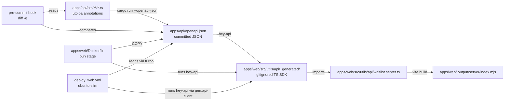
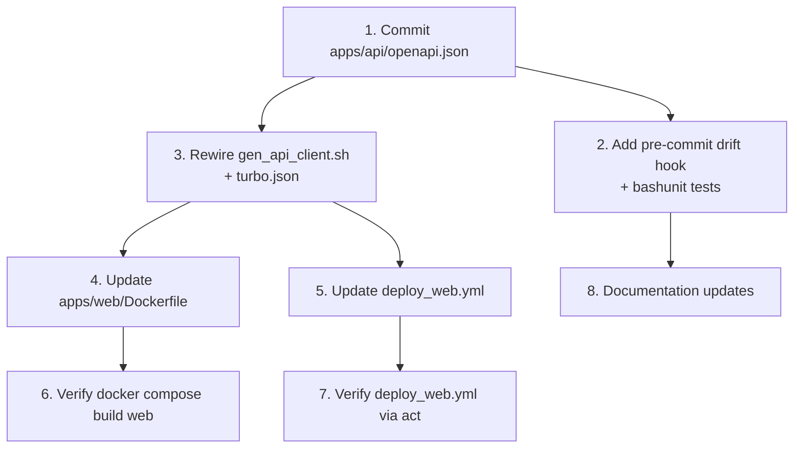

# Design: Openapi Spec Distribution

## Context & Problem

The TanStack Start web app (`apps/web/`) calls the Rust API through a typed
TypeScript SDK that hey-api generates from an OpenAPI spec. The spec is
derived from `utoipa::OpenApi` annotations on the Rust handlers
(`apps/api/src/api/openapi.rs:1`) and is emitted by running the API binary
itself with `--openapi-json` (`apps/api/src/main.rs:18`). The generated SDK
lives at `apps/web/src/utils/api/_generated/` and is gitignored
(`.gitignore:18`).

Two pipelines need this SDK at build time:

1. `docker compose build web` runs `apps/web/Dockerfile`, which is a single
   `oven/bun:1.3.13` stage. It calls `bun --filter @tokenoverflow/web build`
   (vite). There is no Rust toolchain, so `_generated/` never gets created
   and Rolldown fails on unresolved imports
   (`apps/web/src/utils/api/waitlist.server.ts:4`).
2. `.github/workflows/deploy_web.yml` works by installing
   `dtolnay/rust-toolchain` (line 45) and running `bun run build:web` so
   turbo orchestrates `gen:api-client` before `build` (`turbo.json:7`).
   It works, but it ships the full Rust toolchain just to extract a JSON
   document, recompiles the API on every web deploy, and silently couples
   `Deploy Web` health to `apps/api/` compile status.

Both surfaces consume the same spec from the same source-of-truth. They
should share one canonical artifact-distribution mechanism rather than two
ad-hoc paths.

## In Scope

- A single mechanism that publishes the OpenAPI spec as a versioned
  artifact each time `apps/api/` is built.
- Consuming that artifact in `apps/web/Dockerfile` without a Rust
  toolchain.
- Consuming that artifact in `.github/workflows/deploy_web.yml` without
  installing Rust and without recompiling the API.
- Pre-commit guard that keeps the published spec in sync with the
  annotations.
- A graceful local-dev story (`bun run dev`, `docker compose up`,
  fresh-clone first build).

## Out of Scope

- Publishing the SDK itself as an npm package. The SDK is generated from
  the spec; multiple consumers can regenerate locally and only one
  consumer (`apps/web/`) exists today.
- Changing hey-api or swapping for another generator.
- Versioning the API surface across releases (no `v1` to `v2` deprecation
  story yet). When this lands, add `oasdiff` as a semantic diff guard.
- Removing the `// @ts-nocheck` header from generated files; the existing
  workaround in `apps/web/scripts/gen_api_client.sh:35-36` stays.
- Exposing the OpenAPI spec on the live API at runtime (`/openapi.json`
  or Swagger UI). The Rust comment in `apps/api/src/api/openapi.rs:3`
  explicitly says the API does not serve the spec, and keeping it that
  way avoids leaking unstable internals.
- Replacing the existing `apps/web/Dockerfile` two-stage layout. The
  builder/runtime split stays; only inputs to the builder change.
- Multi-language SDK fan-out (Python, Go, etc.). When that need lands, the
  artifact published here is already the right input.
- A `build.rs` based emission. utoipa's spec generation runs through
  procedural macros that only execute when the crate is compiled, not in
  a build script (proc macros are unavailable in `build.rs`; only
  `proc-macro2` token manipulation is). The recommended pattern from the
  utoipa README ("dump generated API doc to file at build time, see issue
  214") is a separate binary target, which is what `--openapi-json` on
  the main binary already does.
  <https://github.com/juhaku/utoipa>

## Terminology

- **Spec**: the OpenAPI 3.1 JSON document derived from the `utoipa`
  annotations. Source of truth for SDK shape.
- **Generated SDK**: TypeScript files emitted by `@hey-api/openapi-ts`
  under `apps/web/src/utils/api/_generated/`. Derived; not committed.
- **Codegen pipeline**: the steps that take Rust source -> spec -> SDK.
  Today implemented in `apps/web/scripts/gen_api_client.sh`.
- **Drift**: a state where the committed spec file no longer matches what
  the Rust source would produce. The pre-commit hook flags this.
- **Build context**: the directory tree Docker mounts as `/`. BuildKit
  additional contexts (`docker build --build-context name=path`) let us
  mount more than one root, including a remote git ref or a prior image
  (<https://docs.docker.com/build/concepts/context/>). Documented here
  only because Option 4 considered using them.

## Key Decisions

### 1. Where does the spec live between API build and web build?

This is the central decision. Every other choice falls out of it. Industry
research uncovered four canonical patterns. The OpenAPI Initiative is
explicit:

> "OpenAPI Descriptions are not just a documentation artifact: they are
> first-class source files which can drive a great number of automated
> processes... they should be among the first files to be committed."
> — OpenAPI Initiative, Best Practices
> (<https://learn.openapis.org/best-practices.html>)

#### ✅ Option 1: Commit the OpenAPI spec JSON, regenerate SDK on consumer build

Treat the spec the same way every OpenAPI-first shop does. Commit
`apps/api/openapi.json` to the repo. A pre-commit hook regenerates it from
the Rust binary and fails if the diff is non-empty (drift detection). The
web Dockerfile copies the JSON file and runs hey-api inside the bun stage.
The deploy workflow does the same.

```dockerfile
# apps/web/Dockerfile (snippet)
COPY apps/api/openapi.json ./apps/api/openapi.json
RUN bun run build:web    # turbo runs gen:api-client (no cargo) then build
```

```yaml
# .github/workflows/deploy_web.yml (snippet)
- name: Build BFF
  run: bun run build:web    # no Rust install needed
```

```bash
# apps/web/scripts/gen_api_client.sh (revised)
SPEC_FILE="$PROJECT_ROOT/apps/api/openapi.json"
bun x @hey-api/openapi-ts --input "$SPEC_FILE" --output ...
```

```yaml
# .pre-commit-config.yaml (new hook)
- id: check-openapi-spec-drift
  name: Check OpenAPI Spec Drift
  entry: scripts/src/git_hooks/check_openapi_spec_drift.sh
  language: script
  files: ^(apps/api/.*\.rs|Cargo\.(toml|lock))$
  pass_filenames: false
```

**Pros:**
- Single source-of-truth artifact: one file. Reviewable in PRs as
  structured JSON, not generated TS.
- Rust toolchain is needed only on the machine that updates the spec
  (developer laptop with pre-commit, plus the Deploy API workflow). It is
  NOT needed for Deploy Web or `docker compose build web`.
- Decouples web deploys from API compile state. If `apps/api/` is broken
  on `main`, web can still ship.
- Matches the OpenAPI Initiative recommendation to treat the spec as a
  first-class artifact, not a derived one
  (<https://learn.openapis.org/best-practices.html>).
- This is the Stripe model (<https://github.com/stripe/openapi>),
  the GitHub model
  (<https://github.com/github/rest-api-description/tree/main/descriptions>),
  and the recommended pattern from the utoipa community
  (<https://identeco.de/en/blog/generating_and_validating_openapi_docs_in_rust/>:
  "add a test that validates the committed OpenAPI file matches the
  generated one").
- hey-api supports local file input cleanly; the change to the codegen
  script is one line. hey-api docs:
  <https://heyapi.dev/openapi-ts/configuration/input>.
- Diff hygiene: the spec is structured JSON; a one-line addition shows as
  a one-line diff.

**Cons:**
- Pre-commit hook needs cargo available. Every contributor already has
  cargo (`scripts/src/setup.sh:14-22`), and the hook is path-scoped to
  `apps/api/**/*.rs` and `Cargo.*` so it only fires on Rust changes.
- One extra file in `apps/api/`.
- Adds ~3 seconds to qualifying commits (the release binary is already
  built on developer laptops; subsequent runs just re-link).

**Rationale:** This is the canonical "API design-first" pattern. Every
production OpenAPI-driven shop the research surfaced does this (Stripe,
GitHub, the utoipa community, OpenAPI Initiative guidance). It removes
the Rust toolchain from two of three pipelines and adds zero runtime
complexity.

#### ❌ Option 2: Commit the generated SDK to the repo

Run codegen locally and check `_generated/` into git. Both Dockerfile and
the deploy workflow consume it directly with no extra step.

**Pros:**
- Builds anywhere with zero external tooling.
- Reproducible commit by commit.

**Cons:**
- Massive diff noise on every API change. hey-api emits thousands of lines
  for a small spec; future PRs reviewing API-shape changes get buried in
  TS diff.
- Generated TS depends on `@hey-api/openapi-ts` versioning. Bumping the
  generator silently rewrites every line.
- Industry consensus is against this pattern. The OpenAPI Initiative
  cautions: "it is also commonplace to use code annotations to generate
  an OpenAPI description and then commit the latter... but this can cause
  confusion about which one is actually in use." Committing the
  downstream SDK compounds that ambiguity by adding a third layer.
  <https://learn.openapis.org/best-practices.html>
- Stripe, GitHub, Cloudflare, and other production OpenAPI shops do not
  ship generated SDKs in the same repo as their source spec. Stripe ships
  the spec (`stripe/openapi`); each SDK lives in its own repo and is
  regenerated by their custom toolchain.
  <https://github.com/stripe/openapi>

**Rationale:** The cost of review noise and generator-bump churn
outweighs the simplicity win.

#### ❌ Option 3: Carve out a tiny `openapi_spec` Rust crate

Move `ApiDoc` and the schema types into a new workspace crate
`apps/openapi_spec/` whose `main.rs` just prints the JSON. The web
Dockerfile installs a minimal Rust toolchain and builds only that crate.

**Pros:**
- No checked-in artifact; spec is always derived.
- Conceptually clean: the SDK input is its own buildable unit.

**Cons:**
- utoipa's `#[derive(ToSchema)]` requires the schema types in scope of
  the crate that derives `OpenApi`. So either every schema type
  (`AddToWaitlistResponse` plus every future schema type) moves to the
  thin crate, or the thin crate depends on the API crate, which pulls in
  axum, diesel, tokio, etc. and defeats the "minimal Rust toolchain"
  benefit.
- Build-script (`build.rs`) variants have the same problem: proc macros
  cannot execute in a build script
  (<https://docs.rs/proc-macro2>), so utoipa's derives cannot run there.
- Refactoring `apps/api/`'s handler/schema layout to extract schemas is a
  large blast radius for a build-system improvement.
- Adds ~150MB of Rust toolchain to the web Dockerfile and ~3 minutes of
  cargo build time, partially offsetting the simplification.

**Rationale:** The refactor cost is high and the win over the accepted
option is conceptual purity, not real ergonomics.

#### ❌ Option 4: Multi-stage Docker with BuildKit additional contexts

The web Dockerfile declares an additional context pointing at the API
image:

```dockerfile
# docker compose build flag:
#   --build-context api=docker-image://tokenoverflow/api:latest
FROM api AS spec_source
RUN /app/tokenoverflow --openapi-json > /openapi.json

FROM oven/bun:1.3.13 AS builder
COPY --from=spec_source /openapi.json /openapi.json
RUN bun ... gen:api-client && bun ... build
```

CI does the same with
`docker buildx build --build-context api=docker-image://tokenoverflow/api:${SHA}`.

**Pros:**
- Cleanest "no commits, no Rust install" story.
- BuildKit native (`additional contexts` shipped in 2022).
  <https://docs.docker.com/build/concepts/context/#additional-contexts>.

**Cons:**
- Adds a deploy-time ordering constraint: API image must be built and
  pushed to a registry before the web Dockerfile can resolve the context.
- The deploy_web workflow currently does NOT use Docker; it runs the
  build directly on the GitHub runner because the artifact is a Lambda
  zip, not an image (`deploy_web.yml:60-69`). Adopting this approach
  forces a switch to Docker-based builds for the Lambda artifact.
- Couples web build success to API image availability in a registry,
  which we do not currently maintain for the API (the API is deployed as
  a Lambda zip, not an image, per `deploy_api.yml:88`).
- `docker compose build` works only if the API image is already built;
  fine for a one-off, but `docker compose build` is supposed to be
  hermetic.

**Rationale:** The deployment topologies for API and web are
intentionally decoupled (Lambda zips, not images), so reusing the API
image would introduce coupling we explicitly avoided when designing the
deploy pipelines.

### 2. How does the committed spec stay in sync with Rust source?

Given Option 2 above, drift between the JSON file and the Rust
annotations is the only new failure mode.

#### ✅ Option 1: Pre-commit drift check that regenerates and fails on diff

```bash
# scripts/src/git_hooks/check_openapi_spec_drift.sh (sketch; full version in Logic)
set -uo pipefail
source scripts/src/api.sh
EXPECTED=apps/api/openapi.json
ACTUAL=$(mktemp -t openapi-spec.XXXXXX.json)
trap 'rm -f "$ACTUAL"' EXIT
gen_api_spec "$ACTUAL"
if ! diff -q "$EXPECTED" "$ACTUAL" > /dev/null; then
  echo "ERROR: ${EXPECTED} is stale. Run 'gen_api_spec' and commit." >&2
  diff -u "$EXPECTED" "$ACTUAL" >&2 | head -80
  exit 1
fi
```

Triggered by `.pre-commit-config.yaml` only when `apps/api/**/*.rs` or
`Cargo.{toml,lock}` change. Follows the existing repo pattern for `cargo-fmt`,
`cargo-clippy`, `cargo-audit` (`.pre-commit-config.yaml:94-111`).

**Pros:**
- Catches drift before it lands on main.
- Mirrors the pattern already used in this repo for Rust-derived assets.
- Single source of truth: the Rust annotations.
- Endorsed by Speakeasy, Stripe, and the utoipa community as the standard
  way to handle this class of drift
  (<https://www.speakeasy.com/blog/openapi-spec-drift-detection>,
   <https://identeco.de/en/blog/generating_and_validating_openapi_docs_in_rust/>).

**Cons:**
- Adds ~3s to qualifying commits (after first build cache warm).
- Requires cargo on contributor machines; the repo already requires this
  per `scripts/src/setup.sh:14`.

**Rationale:** Industry standard for design-first APIs. Used by Stripe
(their `openapi` repo gates PRs on a regeneration check), the FastAPI
ecosystem, and every major OpenAPI tooling vendor.

#### ❌ Option 2: CI-only drift check

Same script, but only runs in a GitHub Actions job on PRs.

**Cons:**
- Surfaces the failure at PR time, after the developer has already
  committed and pushed. Wastes CI minutes and developer context.
- Doesn't prevent the case where a contributor without cargo installed
  edits a handler comment that happens to change the spec; pre-commit
  catches this earlier.

**Rationale:** Pre-commit catches drift at commit time, before push and
before any CI minutes are spent. Faster feedback loop.

#### ❌ Option 3: Use a semantic diff tool (`oasdiff`)

Adopt `oasdiff` (<https://github.com/oasdiff/oasdiff>) instead of plain
`diff`.

**Cons:**
- We own both ends of the pipe (same Rust source, same `serde_json`
  serializer). Byte-level diff is sufficient and gives a clearer signal
  than semantic diff (which would tolerate cosmetic changes we explicitly
  want to flag).
- Adds a new tool to the contributor setup.

**Rationale:** Plain `diff` is sufficient because we own both ends of
the pipe. Revisit when versioned API surfaces land (semantic diff
becomes useful once we are comparing across spec versions for
breaking-change detection, which is on the explicit Out of Scope list).

### 3. Where does the spec file live?

#### ✅ Option 1: `apps/api/openapi.json`

Co-located with the source that emits it. Owner is obvious. The path maps
directly to the producing crate.

**Pros:**
- Discoverability. If a contributor wonders where the spec is, they look
  in the API directory.
- Mirrors how Stripe
  (<https://github.com/stripe/openapi/tree/master/openapi>) and GitHub
  (<https://github.com/github/rest-api-description/tree/main/descriptions>)
  organize spec files inside the source-of-truth tree.

**Cons:**
- The web Dockerfile must `COPY apps/api/openapi.json` even though it
  copies no other API source. Tiny extra line.

#### ❌ Option 2: `apps/web/src/utils/api/openapi.json`

Lives next to the consumer.

**Cons:**
- Misleading ownership: the file is produced by Rust source in
  `apps/api/`, consumed by TS. Putting it under `apps/web/` implies the
  web app owns it.
- Future consumers (Python SDK, CLI) would have to reach into the web
  app's source tree.

#### ❌ Option 3: `openapi.json` at repo root

**Cons:**
- Pollutes root with a domain-specific file.
- Project root reserved for top-level tooling (turbo, package.json,
  Cargo.toml).

### 4. How does turbo orchestrate this?

Today turbo declares `build` depends on `gen:api-client` (`turbo.json:7`)
and `gen:api-client` outputs `_generated/**` (`turbo.json:10`).

#### ✅ Option 1: Keep turbo dependency; change script source

Keep `gen:api-client` as the task that produces `_generated/`. Update the
script to read from `apps/api/openapi.json` instead of shelling out to
cargo. Add the spec file path to the task's `inputs` so turbo re-runs only
when the spec changes.

```jsonc
// turbo.json
"gen:api-client": {
  "inputs": [
    "$TURBO_DEFAULT$",
    "$TURBO_ROOT$/apps/api/openapi.json"
  ],
  "outputs": ["src/utils/api/_generated/**"],
  "cache": true
}
```

`$TURBO_ROOT$` is the documented way to reference files outside the
package directory. A bare `../../` path is rejected by turbo with "the
path you are attempting to specify is outside of the root"
(<https://turborepo.dev/docs/reference/configuration#inputs>).

**Pros:**
- Preserves the existing `bun run build:web` UX.
- Turbo cache keys on the spec file content; SDK is regenerated only when
  the spec actually changes
  (<https://turborepo.dev/docs/crafting-your-repository/configuring-tasks>).
- Removes the `TOKENOVERFLOW_BUNDLED_LIBS` env from the task config; no
  cargo needed.

**Cons:**
- None; this is the minimal change consistent with the rest of the
  decisions.

#### ❌ Option 2: Inline codegen into vite build via `@hey-api/vite-plugin`

Move the hey-api invocation into a vite plugin (`@hey-api/vite-plugin`)
that runs at vite build start.

**Cons:**
- Turbo can no longer cache the codegen step. The full SDK is regenerated
  on every `vite build`, even when the spec is unchanged.
- Couples build tool choice to codegen; switching off Vite would mean
  rewiring codegen.

### 5. Pinning hey-api: lockfile-managed or version flag?

The codegen script today calls `bun x @hey-api/openapi-ts` without a
version. `@hey-api/openapi-ts` is in `devDependencies`
(`apps/web/package.json:30` -> `0.97.0`), and `bun x` prefers the
workspace version. Latest published version is `0.97.2`
(per npm registry, May 2026), so we are within one patch version. Good
enough.

**Decision (no alternatives needed):** Keep `bun x @hey-api/openapi-ts`
as-is; the workspace dep pin (`0.97.0`) already governs the version.
Document this in the script comment so a future contributor does not add
a redundant `--version` flag.

## Architecture Overview



The single artifact `apps/api/openapi.json` is the boundary between Rust
and TS. Everything to the left of it requires cargo; everything to the
right requires only bun.

Pipeline characteristics after this change:

| Pipeline                       | Rust toolchain? | Recompiles API? | Reads spec from |
| ------------------------------ | --------------- | --------------- | --------------- |
| `docker compose build web`     | No              | No              | Committed JSON  |
| `.github/workflows/deploy_web` | No              | No              | Committed JSON  |
| `apps/api/` PR pre-commit      | Yes             | Yes (once)      | Rust source     |
| `.github/workflows/deploy_api` | Yes             | Yes             | Rust source     |
| `bun run dev` (local)          | No              | No              | Committed JSON  |

For reference, `.github/workflows/deploy_landing.yml` is the shape
`deploy_web.yml` ends up at after this change: pure bun, ubuntu-slim, no
toolchain install.

## Third Party Dependencies

| Capability                | Library                  | Version  | Alternative considered           | Why chosen                                                                                                          |
| ------------------------- | ------------------------ | -------- | -------------------------------- | ------------------------------------------------------------------------------------------------------------------- |
| OpenAPI derive from Rust  | `utoipa`                 | 5.x      | `aide`, `okapi`, `paperclip`     | Already adopted (`apps/api/Cargo.toml:92`); active maintenance; ToSchema derive ergonomics; axum-extras integration |
| TS SDK generation         | `@hey-api/openapi-ts`    | 0.97.x   | `openapi-typescript-codegen`, `orval`, `openapi-fetch` | Already adopted; framework-agnostic output; supports OpenAPI 3.0 and 3.1; used by Vercel, OpenCode, PayPal in production (<https://github.com/hey-api/openapi-ts>) |
| Drift check               | none (pure bash + diff)  | -        | `oasdiff`                        | Plain `diff` is sufficient because we own both ends of the pipe; semantic diff becomes useful when we ship versioned APIs (Out of Scope) |
| Spec validation (future)  | `redocly lint` / `spectral` | n/a (out of scope) | -                          | utoipa generates compliant 3.1 specs; add a linter only if we hit non-compliance                                    |

No new third-party dependency is added by this design.

## Structure

```text
apps/
  api/
    openapi.json                          # NEW. Committed. Source-of-truth spec.
    src/
      main.rs                             # unchanged
      api/openapi.rs                      # unchanged
      api/routes/waitlist.rs              # unchanged (utoipa annotations)
  web/
    Dockerfile                            # MODIFIED. Copies apps/api/openapi.json, runs hey-api.
    scripts/
      gen_api_client.sh                   # MODIFIED. Reads JSON file; no cargo call.
    src/utils/api/
      _generated/                         # unchanged (gitignored)
      waitlist.server.ts                  # unchanged
.github/workflows/
  deploy_web.yml                          # MODIFIED. Removes Rust install + TOKENOVERFLOW_BUNDLED_LIBS env.
                                          # Adds apps/api/openapi.json to the `paths:` filter.
scripts/src/
  api.sh                                  # NEW. Domain module exposing gen_api_spec().
  includes.sh                             # MODIFIED. Sources api.sh.
  git_hooks/
    check_openapi_spec_drift.sh           # NEW. Pre-commit drift check.
scripts/tests/
  git_hooks/
    test_check_openapi_spec_drift.sh      # NEW. Bashunit tests for the drift hook.
.pre-commit-config.yaml                   # MODIFIED. Adds check-openapi-spec-drift hook.
turbo.json                                # MODIFIED. gen:api-client inputs now include the JSON file.
```

## Specs & Standards

- **OpenAPI Specification 3.1.0**: the format of `apps/api/openapi.json`.
  utoipa emits 3.1.0 by default since utoipa 4.0.
  <https://spec.openapis.org/oas/v3.1.0>
- **JSON Schema 2020-12**: the schema dialect used inside an OpenAPI 3.1
  document, per OAS 3.1 section 4.7.24.
  <https://json-schema.org/draft/2020-12/release-notes>
- **OpenAPI Initiative "Best Practices" guidance**: treat the spec as a
  versioned, reviewable artifact rather than a build-time derivation.
  <https://learn.openapis.org/best-practices.html>
- **pre-commit framework**: hook layout in `.pre-commit-config.yaml`
  follows <https://pre-commit.com/#new-hooks> and the existing local-hooks
  block (`cargo-fmt`, `cargo-clippy`, `cargo-audit`,
  `cargo-coverage` at `.pre-commit-config.yaml:94-117`).
- **Repo conventions** (`CLAUDE.md`): snake_case filenames, no em-dash or
  double-dash, `TOKENOVERFLOW_` env prefix. The new files `api.sh` and
  `check_openapi_spec_drift.sh` follow this. The function name
  `gen_api_spec` mirrors the existing `gen_api_client` naming.
- **GitHub Actions conventions** (`.github/workflows/CLAUDE.md`): pin
  action SHAs; reuse the same versions; test workflows with `act` and
  include them in pre-commit. The `act-deploy-web` hook
  (`.pre-commit-config.yaml:138-143`) already exercises this workflow on
  qualifying changes.

## Interfaces

### CLI: emit the spec

```bash
cargo run --release --manifest-path apps/api/Cargo.toml -- --openapi-json
```

Output contract: a single JSON document on stdout that parses as OpenAPI
3.1.0. The handler at `apps/api/src/main.rs:18-22` already implements
this; no change.

### File: `apps/api/openapi.json`

UTF-8 JSON, pretty-printed (2-space indent matches
`serde_json::to_string_pretty` default), trailing newline. Stable byte-for-byte
across runs given the same Rust source and same `serde_json` / `utoipa`
versions, which are pinned via `Cargo.lock`.

### Pre-commit hook contract

Hook id: `check-openapi-spec-drift`. Runs when any `apps/api/**/*.rs`,
`Cargo.toml`, or `Cargo.lock` file is staged. Exit code 0 if
`apps/api/openapi.json` matches the regenerated spec. Exit code 1
otherwise, printing a unified diff and the remediation command.

### Dockerfile contract

The web Dockerfile expects `apps/api/openapi.json` to exist in the build
context. Failure mode if missing: `COPY` fails with a clear error. No
silent fallback; a missing file means someone broke the contract.

## Existing Code & Reuse

| What already exists                                | How this design uses it                                                                |
| -------------------------------------------------- | -------------------------------------------------------------------------------------- |
| `apps/api/src/main.rs:18` `--openapi-json` flag    | Unchanged. The pre-commit hook invokes it; the same cargo command is the canonical way to regenerate the spec manually. |
| `apps/api/src/api/openapi.rs` `ApiDoc`             | Unchanged. Adding new routes still means adding to the `paths` / `components` macros. |
| `apps/web/scripts/gen_api_client.sh`               | Modified. The `cargo run` line is replaced with a read of `apps/api/openapi.json`.     |
| `turbo.json` `gen:api-client` task                 | Modified `inputs` and `env`; semantics unchanged.                                      |
| `// @ts-nocheck` prepending logic                  | Reused as-is. Lines 35-36 of the codegen script stay.                                  |
| `apps/web/src/utils/api/waitlist.server.ts`        | Unchanged. The generated SDK shape is unchanged.                                       |
| `cargo-*` pre-commit hooks (`.pre-commit-config.yaml:94-117`) | Pattern reused: `language: system` or `language: script`, `pass_filenames: false`, scoped via `files:`. |
| `act-deploy-web` pre-commit hook (`.pre-commit-config.yaml:138-143`) | Reused. The updated workflow will be re-verified through this hook on `act push`. |

## Logic

### API helper module

The cargo invocation that regenerates the spec lives in one place: a
shell function in `scripts/src/api.sh`, sourced via `scripts/src/includes.sh`
alongside the other domain modules (`docker.sh`, `mcp.sh`, `tf.sh`, etc.).

```bash
#!/usr/bin/env bash
# scripts/src/api.sh

# Regenerate the API's OpenAPI spec from utoipa annotations.
# Writes to apps/api/openapi.json by default. The pre-commit drift hook
# passes a temp path to compare against the committed copy.
function gen_api_spec() {
  local out="${1:-apps/api/openapi.json}"
  cargo run \
    --quiet --release \
    --manifest-path apps/api/Cargo.toml \
    -- --openapi-json > "$out"
}
```

`scripts/src/includes.sh` gets one new line:

```bash
# shellcheck source=scripts/src/api.sh
source "${SCRIPT_DIR}/api.sh"
```

Contributors regenerate manually with `source scripts/src/includes.sh
&& gen_api_spec`. The CI workflows do not need this function (they read
the committed spec); only the pre-commit hook and human operators do.

### Pre-commit drift check

```bash
#!/usr/bin/env bash
# scripts/src/git_hooks/check_openapi_spec_drift.sh
set -uo pipefail

# shellcheck source=scripts/src/api.sh
source "$(cd "$(dirname "${BASH_SOURCE[0]}")/.." && pwd)/api.sh"

EXPECTED="apps/api/openapi.json"
ACTUAL="$(mktemp -t openapi-spec.XXXXXX.json)"
CARGO_LOG="$(mktemp -t openapi-spec-cargo.XXXXXX.log)"
trap 'rm -f "$ACTUAL" "$CARGO_LOG"' EXIT

# Distinguish "cargo build broken" from "spec drift". A failing cargo build
# is its own problem; do not mask it as a drift error.
if ! gen_api_spec "$ACTUAL" 2>"$CARGO_LOG"; then
  echo "ERROR: cargo failed while regenerating ${EXPECTED}." >&2
  echo "Fix the API build, then re-commit." >&2
  cat "$CARGO_LOG" >&2
  exit 1
fi

if ! diff -q "$EXPECTED" "$ACTUAL" > /dev/null; then
  echo "ERROR: ${EXPECTED} is stale (out of sync with apps/api/ source)." >&2
  echo "Regenerate and re-commit:" >&2
  echo "  source scripts/src/includes.sh && gen_api_spec" >&2
  echo "  git add ${EXPECTED}" >&2
  diff -u "$EXPECTED" "$ACTUAL" >&2 | head -80
  exit 1
fi
```

The hook sources `api.sh` directly (not the whole `includes.sh`) so it
only pulls in what it needs. The error message tells contributors to
source `includes.sh` for interactive use, which gives them the same
function plus the rest of the project's helpers.

### Web codegen (after change)

```bash
#!/usr/bin/env bash
# apps/web/scripts/gen_api_client.sh
set -euo pipefail

cd "$(dirname "$0")/../../.."

SPEC_FILE="apps/api/openapi.json"
if [[ ! -f "$SPEC_FILE" ]]; then
  echo "Missing ${SPEC_FILE}. Regenerate it:" >&2
  echo "  source scripts/src/includes.sh && gen_api_spec" >&2
  exit 1
fi

cd apps/web
bun x @hey-api/openapi-ts \
  --input "../../${SPEC_FILE}" \
  --output src/utils/api/_generated

find src/utils/api/_generated -type f -name '*.ts' -exec \
  sh -c 'printf "// @ts-nocheck\n%s" "$(cat "$1")" > "$1"' shell {} \;
```

### Dockerfile (web)

```dockerfile
FROM oven/bun:1.3.13 AS builder
WORKDIR /app

COPY package.json bun.lock bunfig.toml turbo.json ./
COPY apps/web ./apps/web
COPY apps/landing/package.json ./apps/landing/package.json
COPY packages ./packages
COPY apps/api/openapi.json ./apps/api/openapi.json   # NEW

RUN bun install --frozen-lockfile

ENV NITRO_PRESET=node-server
RUN bun run build:web    # turbo runs gen:api-client (no cargo) then vite build

FROM node:22-slim AS runtime
WORKDIR /app
COPY --from=builder /app/apps/web/.output ./.output
EXPOSE 3000
CMD ["node", ".output/server/index.mjs"]
```

Replacing `bun --filter @tokenoverflow/web build` with `bun run build:web`
makes turbo orchestrate `gen:api-client` -> `build`, which is what we
want.

### deploy_web.yml diff (conceptual)

```yaml
on:
  push:
    branches: [ main ]
    paths:
      - "apps/web/**"
      - "packages/**"
      - "bun.lock"
      - "apps/api/openapi.json"          # NEW: rebuild web on spec changes

- name: Install Rust toolchain          # DELETE
  uses: dtolnay/rust-toolchain@...
  with:
    toolchain: stable

- name: Build BFF
  env:
    TOKENOVERFLOW_BUNDLED_LIBS: "1"     # DELETE
  run: bun run build:web
```

The `paths` addition ensures a spec change correctly triggers a web
re-deploy.

## Edge Cases & Constraints

- **Fresh clone, no `apps/api/openapi.json`**: caught by the existence
  check in `gen_api_client.sh` and the `COPY` failure in the Dockerfile.
  The remediation is `git pull` or the cargo command shown in the error.
  The file is committed, so a fresh clone has it.
- **Local dev with `bun run dev`**: vite dev does not run the build
  pipeline. The current behavior already requires the developer to run
  `bun run gen:api-client` once before `dev`. Same after this change, but
  the codegen step is now ~3s instead of ~30s (no cargo).
- **Rust commit that doesn't affect the spec**: the hook runs cargo (no
  way to know without doing the work), compares JSON, finds no diff,
  exits 0. Cost: ~3s on a warm release build.
- **Concurrent `apps/api/` rebuild from cargo-watch**: `--release` builds
  share the same target dir; this is fine because the hook is a one-shot
  invocation.
- **`@hey-api/openapi-ts` version bump**: not blocked by this design. A
  version bump is a normal lockfile change; the next codegen run picks it
  up. Drift hook still passes because it only diffs the input spec, not
  the generated TS.
- **utoipa version bump**: bumping utoipa may change the generated spec;
  the hook will catch the drift and force a `regen + commit`.
- **Spec compatibility with hey-api**: hey-api supports OpenAPI 3.0 and
  3.1 (<https://heyapi.dev/openapi-ts/get-started>). utoipa emits 3.1 by
  default. Validated by the current pipeline already working in CI.
- **Pretty-print determinism**: `serde_json::to_string_pretty` is stable
  across `serde_json` versions (2-space indent, insertion-order keys
  preserved from `serde_derive`). Cargo.lock pins serde_json so output is
  byte-stable.
- **Determinism of `utoipa` derive**: utoipa emits paths in source-
  declaration order. Adding routes appends; reordering source reorders
  the spec. The drift hook will catch reorderings, which is the desired
  behavior (they show as one diff hunk per move).
- **Lambda zip size**: unchanged. The `apps/api/openapi.json` is never
  shipped in the Lambda; it lives in the repo and the web build context.
- **`act` testing of deploy_web**: removing the Rust install step
  shortens local `act` runs by ~90 seconds. The existing
  `.github/workflows/CLAUDE.md` rule "test the workflow with ACT" still
  applies; the existing `act-deploy-web` pre-commit hook
  (`.pre-commit-config.yaml:138-143`) handles this.
- **Web deploy on spec change**: today `deploy_web.yml` does not trigger
  on any `apps/api/**` path. After this change the same is still true
  for Rust source files (which is correct: behavior-only changes that do
  not move the surface should not redeploy the web). Adding
  `apps/api/openapi.json` to the `paths:` filter introduces the one
  trigger we do want: a surface change. Net effect: web stays in lockstep
  with the spec, but is unaffected by purely internal Rust refactors.

## Test Plan

### Unit (bashunit)

`scripts/tests/git_hooks/test_check_openapi_spec_drift.sh` mirrors the
layout of the existing `scripts/tests/git_hooks/test_trivy.sh`. Cases:

- `test_passes_when_committed_spec_matches_source`: stub `cargo` to write
  the current `apps/api/openapi.json` bytes to stdout; assert exit 0.
- `test_fails_when_committed_spec_is_stale`: stub `cargo` to write a
  modified spec; assert exit 1, stderr contains the remediation
  command and a diff hunk.
- `test_fails_loud_when_cargo_build_broken`: stub `cargo` to exit 1 with
  a build-error message; assert exit 1, stderr contains "cargo failed"
  and the build-error text, and does NOT mention drift or skipping.
- `test_no_temp_files_leak`: assert `mktemp` paths are removed after the
  hook exits (success and failure paths).

The cargo binary is stubbed via a function override exported into the
hook's `$PATH`, following the same `act() {...}; export -f act` pattern
as `scripts/tests/test_act.sh:13-14`.

### Integration

- **`docker compose build web`** from a clean state: should succeed in
  under 90 seconds (vs the current state of failing entirely). Run as
  part of task 6 verification.
- **`act` exercise of `deploy_web.yml`**: the existing `act-deploy-web`
  pre-commit hook (`.pre-commit-config.yaml:138-143`) re-runs the
  workflow locally. After the change, this must succeed without the
  Rust install step.

### E2E

- **`apps/web/` typecheck**: `bun run check` already exercises the SDK
  imports. If the spec changes the response shape, codegen reshapes the
  SDK, and `tsc` catches consumer breakage at PR time. No new test
  needed.
- **Live workflow smoke**: after merge, trigger `deploy_web.yml` once
  via `workflow_dispatch` to confirm cloud-side parity.

## Documentation Changes

- New file `apps/api/CLAUDE.md` is out of scope (the repo currently has
  `apps/api/src/CLAUDE.md` but no `apps/api/CLAUDE.md`). Instead, add a
  short "Spec sync" section to `apps/api/src/CLAUDE.md` noting that
  `apps/api/openapi.json` is checked in and the pre-commit hook enforces
  sync. Include the canonical cargo command for manual regen.
- `apps/web/scripts/gen_api_client.sh`: the existing inline comment block
  (lines 1-9) is updated to reflect the new contract (reads JSON file,
  no cargo).
- Root `CLAUDE.md`: no change. The spec-distribution mechanism is an
  implementation detail.
- `.github/workflows/deploy_web.yml`: update the now-stale comment block
  (lines 41-48) that explains the Rust install. Replace with a one-liner
  explaining `gen:api-client` reads the committed spec.

## Development Environment Changes

- `Brewfile`: no change. cargo is already a setup-step requirement
  (`scripts/src/setup.sh:14-22`).
- New file: `scripts/src/api.sh` exposing `gen_api_spec`.
- Modified: `scripts/src/includes.sh` sources `api.sh`.
- New file: `scripts/src/git_hooks/check_openapi_spec_drift.sh`.
- New file: `scripts/tests/git_hooks/test_check_openapi_spec_drift.sh`.
- New entry in `.pre-commit-config.yaml` under the existing local-hooks
  block.
- No new environment variables. `TOKENOVERFLOW_BUNDLED_LIBS` keeps its
  meaning for `deploy_api.yml`; it is just no longer needed by
  `deploy_web.yml` or its turbo task config.

## Tasks



| # | Task Name                  | Task Description                                                                                                                            | Success Criteria                                                                                                                | Dependencies |
|---|----------------------------|---------------------------------------------------------------------------------------------------------------------------------------------|---------------------------------------------------------------------------------------------------------------------------------|--------------|
| 1 | Commit the spec            | Add `license(name = "MIT")` to `ApiDoc` in `apps/api/src/api/openapi.rs` (the repo is MIT licensed; utoipa's default is an empty `license.name` block). Run `cargo run --quiet --release --manifest-path apps/api/Cargo.toml -- --openapi-json > apps/api/openapi.json`. Commit the resulting file. | `git status` shows the new file and the one-line `openapi.rs` change; `cat apps/api/openapi.json \| jq .info.license` returns `{"name": "MIT"}`. | none         |
| 2 | API helper + drift hook    | Add `scripts/src/api.sh` exposing `gen_api_spec`. Source it from `scripts/src/includes.sh`. Add `scripts/src/git_hooks/check_openapi_spec_drift.sh` (sources `api.sh`) and `scripts/tests/git_hooks/test_check_openapi_spec_drift.sh`. Wire the `check-openapi-spec-drift` hook in `.pre-commit-config.yaml` scoped to `apps/api/**/*.rs` and `Cargo.{toml,lock}`. | `source scripts/src/includes.sh && gen_api_spec` regenerates `apps/api/openapi.json`. All four bashunit cases pass. Modifying a handler schema without regenerating fails pre-commit. Modifying only TS passes pre-commit. A failing cargo build produces a "cargo failed" error, not a drift error. | 1            |
| 3 | Rewire codegen + turbo     | Replace cargo invocation in `apps/web/scripts/gen_api_client.sh`. Update `turbo.json`'s `gen:api-client` inputs to include `$TURBO_ROOT$/apps/api/openapi.json`. | `bun run build:web` succeeds without cargo on PATH (verifiable in a clean docker container)                                     | 1            |
| 4 | Update web Dockerfile      | Add `COPY apps/api/openapi.json`, switch builder command to `bun run build:web`.                                                            | `docker compose build web` succeeds from a clean state                                                                          | 3            |
| 5 | Update deploy_web workflow | Remove the `Install Rust toolchain` step and the `TOKENOVERFLOW_BUNDLED_LIBS` env from the `Build BFF` step. Add `apps/api/openapi.json` to the `paths:` filter. | Workflow YAML passes `actionlint`; `act-deploy-web` pre-commit hook passes                                                      | 3            |
| 6 | Verify docker path         | Run `docker compose build web` and `docker compose up web --wait` locally.                                                                  | Container reports healthy; `/health` returns 200                                                                                | 4            |
| 7 | Verify CI path             | Trigger `deploy_web.yml` via `workflow_dispatch` on a branch and confirm green.                                                             | Workflow completes successfully without Rust install step                                                                       | 5            |
| 8 | Docs                       | Append a "Spec sync" section to `apps/api/src/CLAUDE.md`; refresh `deploy_web.yml` comment block; update inline comment in `gen_api_client.sh`. | New contributor reading the doc understands when to regenerate the spec                                                         | 2            |
